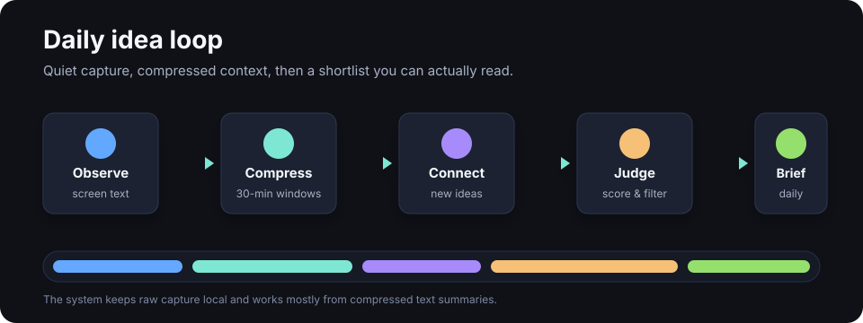
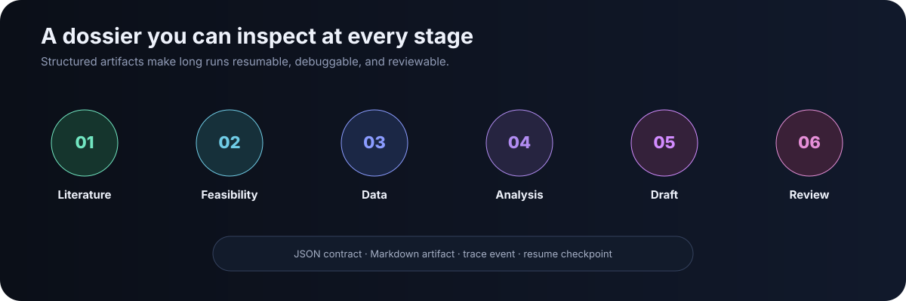
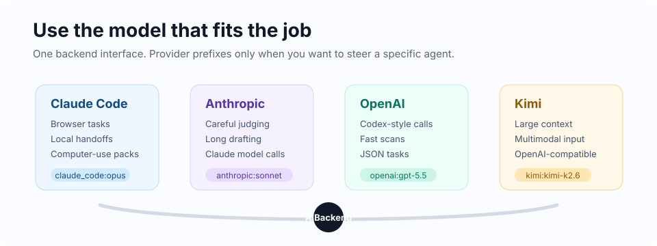

# Digital Unconscious

**A local-first research assistant that turns the traces of your workday into sharper research ideas.**

Digital Unconscious watches the text signals around your screen activity, compresses them into private working notes, proposes cross-domain ideas, scores them, and saves a daily briefing. The strongest ideas can be handed into a staged research pipeline for literature review, feasibility checks, dataset search, analysis, drafting, and review.

It is not a second brain with a chat box. It is closer to a quiet research notebook that notices what you keep circling back to.

<p align="center">
  <a href="https://github.com/shoal-rat/digital-unconscious/blob/main/LICENSE"></a>
  
  
  
</p>

<p align="center">
  
</p>

## What You Get

- A daily Markdown briefing based on what you read, search, and build.
- Idea scoring that favors novelty, feasibility, domain fit, and timing.
- A research backlog you can search later instead of losing half-formed ideas.
- A six-stage research pipeline for ideas worth pursuing.
- Multi-provider model routing across Claude Code, Anthropic API, OpenAI/Codex, and Kimi/Moonshot.
- A small local dashboard at `localhost:9830`.

## Where It Fits

Use it when useful ideas tend to appear sideways: while reading papers, comparing tools, debugging code, scanning datasets, or bouncing between fields. Digital Unconscious is designed to preserve those weak signals before they disappear.

It works best for:

- researchers who read across several fields
- founders and product thinkers collecting patterns
- analysts who want research questions from daily work
- builders who want a private idea pipeline instead of another cloud notebook

It is not meant to record secrets, reuse your browser profile, bypass logins, or make final submissions without review.

## Quick Start

### Install From GitHub

Windows PowerShell:

```powershell
pip install "digital-unconscious[full] @ git+https://github.com/shoal-rat/digital-unconscious.git"
du
```

macOS or Linux:

```bash
pip install "digital-unconscious[full] @ git+https://github.com/shoal-rat/digital-unconscious.git"
du
```

On first run, the setup page opens in your browser. Pick your focus fields, choose an observation source, and set a briefing time.

### Run From Source

```bash
git clone https://github.com/shoal-rat/digital-unconscious.git
cd digital-unconscious
pip install -e ".[full]"
du
```

Try a manual log before wiring up passive capture:

```bash
du daily --log-file tests/fixtures/daily_log.txt
du dashboard
```

## How It Works

1. **Observe**: Read recent screen text from [screenpipe](https://github.com/mediar-ai/screenpipe), or use a JSONL/plain-text log file.
2. **Compress**: Turn 30-minute windows into compact behavior summaries.
3. **Generate**: Ask a creative model to find cross-domain research ideas.
4. **Judge**: Score each idea against novelty, feasibility, relevance, and timing.
5. **Brief**: Save a short daily briefing and append strong ideas to the backlog.
6. **Research**: Optionally promote top ideas into the research pipeline.
7. **Learn**: Update the human idea model and prompt refinements from completed runs.

<p align="center">
  
</p>

## Multi-Provider Backends

Digital Unconscious has one backend interface, but you can route different agents to different providers.

<p align="center">
  
</p>

Default mode is `auto`:

1. Anthropic API if `ANTHROPIC_API_KEY` exists
2. OpenAI API if `OPENAI_API_KEY` exists
3. Kimi/Moonshot if `MOONSHOT_API_KEY` or `KIMI_API_KEY` exists
4. local Claude Code otherwise

When a hosted key is set, `auto` routes through the multi-provider layer so a
failing provider fails over to the next available one — ending at the local
Claude Code CLI. Set `[ai].fallback = false` to pin a single provider.

For deliberate routing, use `mode = "multi"`:

```toml
[ai]
mode = "multi"
creative_model = "openai:gpt-5.5"
judge_model = "anthropic:claude-sonnet-4-6"
compressor_model = "kimi:kimi-k2.6"
briefing_model = "claude_code:opus"
```

More examples live in [docs/MULTI_PROVIDER_BACKENDS.md](docs/MULTI_PROVIDER_BACKENDS.md).

## Core Features

### Passive Observation

- screenpipe integration for local screen-text capture
- JSONL and plain-text fallback logs
- configurable app blacklist
- local storage for raw observation files

### Idea Generation And Judging

- creative idea generation from compressed workday summaries
- focus-field filtering so ideas land in your actual domains
- RAG context from ChromaDB or the file fallback store
- conservative judge thresholds to keep briefings short

### Research Pipeline

- literature search across open scholarly sources
- AI feasibility assessment with risks and recommended methods
- open dataset discovery
- analysis artifact generation
- Markdown and PDF manuscript drafting
- peer-review and revision loop
- supervised computer-use task packs for browser-heavy work

### Learning Loop

- human idea model built from daily ideas and completed research runs
- prompt evolution with shadow-tested edits
- domain knowledge expansion from successful runs
- conservative scheduler to avoid overfitting to one noisy day

### Desktop Workflow

- tray icon for quick actions
- dashboard for briefings, backlog, learning, and service status
- background service daemon
- optional autostart on login

### Reliability, Reasoning, And Cost

- automatic provider failover across Claude, OpenAI, Kimi, and local Claude Code
- optional extended-thinking budgets for idea generation and judging
- per-cycle token and cost tracking in the briefing footer and dashboard
- circuit breaker with retries and exponential backoff

## Commands

| Command | Use it for |
| --- | --- |
| `du` | Launch the desktop experience |
| `du setup` | Re-run the setup wizard |
| `du dashboard` | Open the local web dashboard |
| `du daily` | Run one daily cycle now |
| `du daily --log-file path/to/log.txt` | Run from a manual activity log |
| `du research --idea "..."` | Run the research pipeline for one idea |
| `du research --auto` | Pick the strongest backlog idea |
| `du learn` | Update the learning model |
| `du config --focus "field1,field2"` | Set focus fields for idea filtering |
| `du service start` | Start the background daemon |
| `du service status` | Check daemon state |
| `du credential add/list` | Manage encrypted credentials |
| `du export-computer-task --run-id ID` | Create a supervised browser task pack |

## Configuration

Most settings live in [config/pipeline.toml](config/pipeline.toml).

```toml
[ai]
mode = "auto"            # auto-upgrades to multi-provider failover when a key is set
fallback = true
think_idea_budget = 0    # set e.g. 8192 to enable extended thinking for ideas
think_judge_budget = 0

[idea]
primary_domains = ["AI tools", "product design"]
secondary_domains = ["cognitive science", "business models"]
focus_fields = ["economics research", "management"]
include_threshold = 75
max_ideas_per_cycle = 8

[observation]
enabled = true
screenpipe_url = "http://localhost:3030"
blacklist_apps = ["game", "video_player"]

[automation]
auto_execute = false
checkpoint_policy = "best_effort"
```

Use environment variables for model keys:

```bash
export ANTHROPIC_API_KEY="..."
export OPENAI_API_KEY="..."
export MOONSHOT_API_KEY="..."
```

On Windows PowerShell:

```powershell
$env:ANTHROPIC_API_KEY = "..."
$env:OPENAI_API_KEY = "..."
$env:MOONSHOT_API_KEY = "..."
```

## Privacy And Safety

- Raw screenshots stay local. The pipeline works from text summaries.
- Only compressed summaries and selected task prompts are sent to model APIs.
- No telemetry and no cross-user learning.
- App and domain blacklists are configurable.
- Credentials are stored in an encrypted local vault.
- Browser automation uses explicit task packs and manual checkpoints for CAPTCHA, MFA, consent, and payment walls.
- Final submission workflows require approval.

## Project Map

```text
src/du_research/
  agents/             model-backed agents
  stages/             literature, feasibility, data, analysis, drafting, review
  ai_backend.py       Claude Code, Anthropic, OpenAI, and Kimi routing
  automation.py       browser task-pack runners
  credential_broker.py encrypted credential vault
  dashboard.py        local web UI
  engine.py           daily cycle and learning orchestration
  observation.py      screenpipe and file observation
  pipeline.py         six-stage research pipeline
  rag.py              ChromaDB or file-backed knowledge store
```

## Testing

The test suite uses `unittest`:

```bash
python -m unittest discover -s tests -v
```

For a lightweight import check:

```bash
python -c "from du_research.ai_backend import create_backend; print(type(create_backend('claude_code')).__name__)"
```

## Notes For Contributors

- Read [AGENTS.md](AGENTS.md) before making agent-assisted changes.
- Keep optional integrations lazy at import time.
- Do not commit runtime data from `workspace/`.
- Keep browser automation supervised and allowlisted.

## License

MIT. See [LICENSE](LICENSE).
