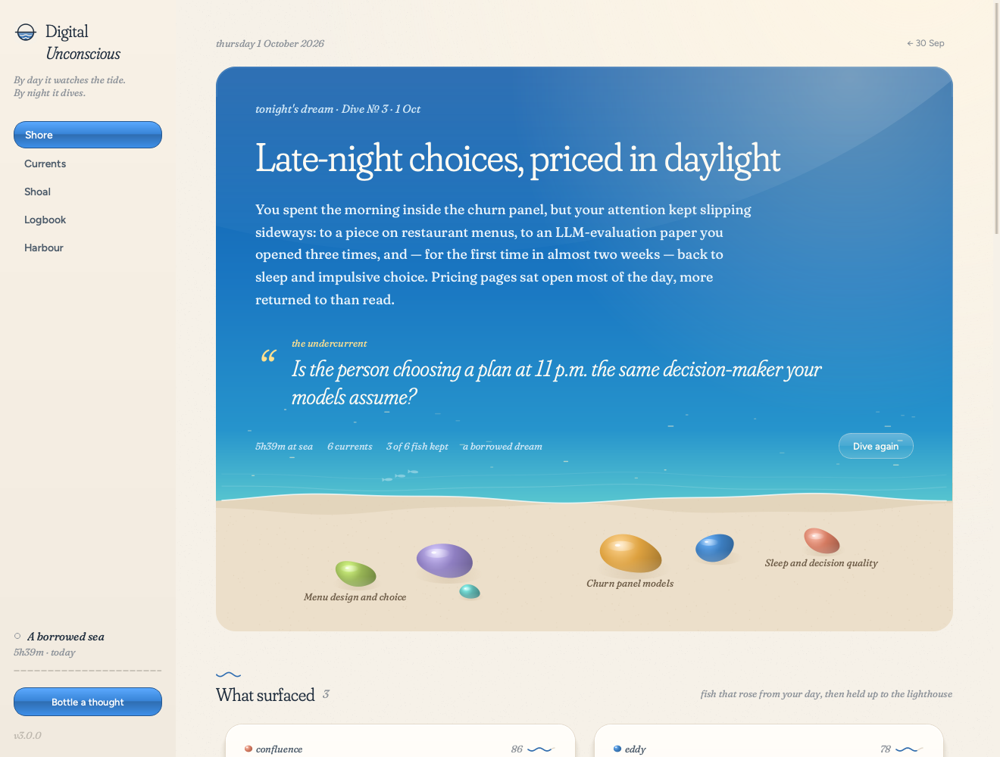
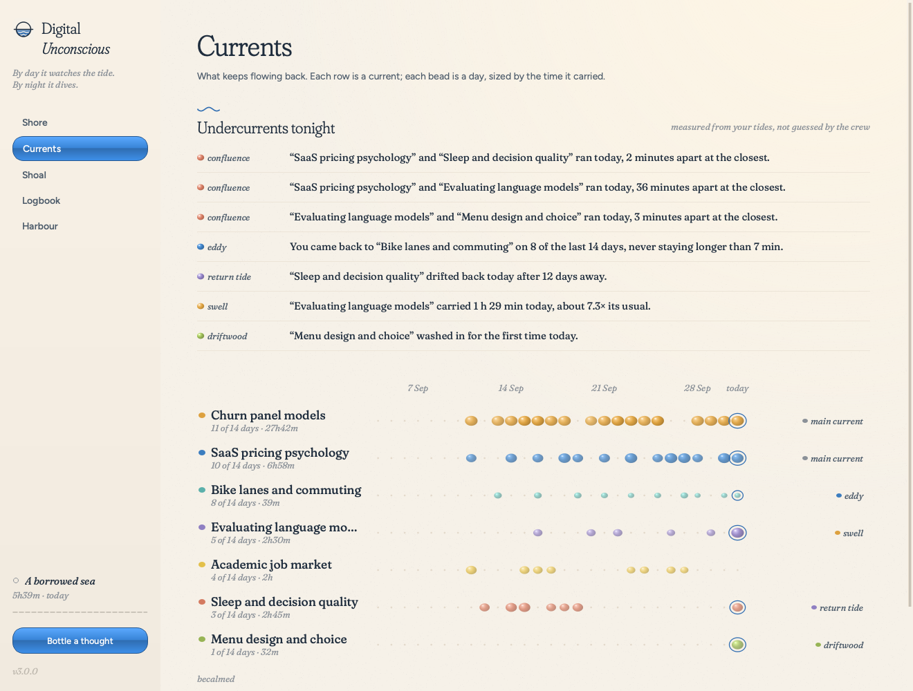
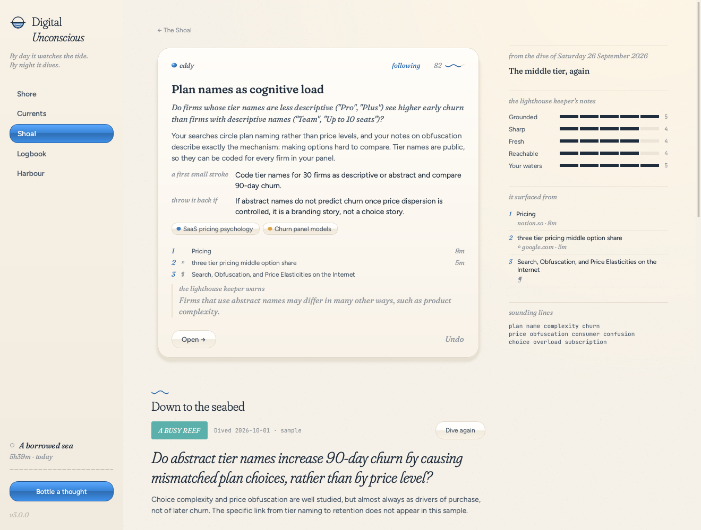
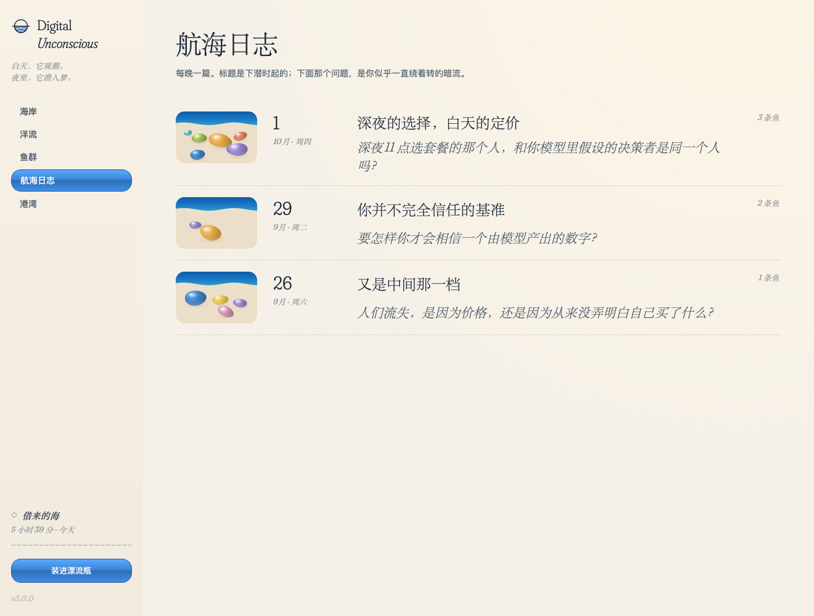
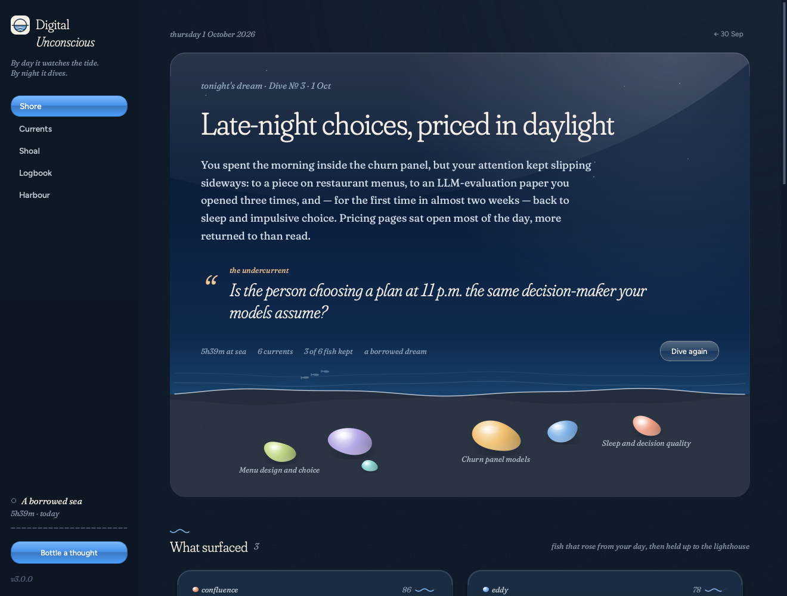

<p align="center">
  
</p>

<p align="center"><em>By day it watches the tide of your attention. At night it dives for what you didn't notice.</em></p>

<p align="center">
  
</p>

Digital Unconscious is a small desktop app for one person, imagined as a little sea.

During the day a **tide watcher** notices where your attention drifts: the window in front of you, the pages you
keep returning to, what you search for, the thoughts you put in a **bottle**. At night it **dives**. It sorts the
day's catch into **currents** (the concerns that keep flowing back), reads the **undercurrents** running through
them, and brings back a short reflection, the one question you seem to be circling, and a few **fish**: ideas that
rose from your own day, each held up to the **lighthouse** by a second model before you see it.

It is for people who think for a living (researchers, writers, builders) and want the half-formed things to surface
instead of sinking.

> **v3 is a ground-up rebuild.** The browser dashboard, the manuscript pipeline, browser automation and the
> credential vault are gone. What remains is the original idea, done properly, as a native app.
> See [What changed](#what-changed-in-v3).

## The ecosystem

<p align="center">
  
</p>

1. **Watch the tide.** Every few seconds the watcher glances at the front window (app, title and, where the system
   allows, the browser address) and lays it down as a **driftline** with real time attached. At **slack water** (no
   keyboard or mouse for a while) it stops counting. Private windows, password managers and banks sit in **fog** and
   are never recorded; chat apps leave only the time they took.
2. **Sort the catch.** A deckhand model groups the day into topics and lets each join a **current**
   ("SaaS pricing psychology", "bike lanes and commuting"). Code keeps the charts honest: every reference is checked,
   and a current that already exists is joined rather than drawn twice.
3. **Read the currents.** Plain arithmetic over weeks of tides finds the undercurrents. The crew interprets them; it
   never counts them.

   | Undercurrent | What it means | In code |
   | --- | --- | --- |
   | **eddy** | you come back again and again, never for long: circling without diving in | `orbit` |
   | **return tide** | a current drifted back after a long absence | `return` |
   | **swell** | far more time today than its usual | `surge` |
   | **driftwood** | something new washed in, with real time or a bottle behind it | `seed` |
   | **confluence** | two distant currents ran close together today | `collision` |
   | main current · ebb | your known main work, and what has gone quiet | `steady` · `fade` |

4. **Dive.** The strongest diver aboard writes a headline for the night, a reflection, the **undercurrent** (one
   question), and a handful of candidate fish. Each fish must rise from one movement of the water (confluence, eddy,
   return tide, swell, driftwood, or a *channel* between what you read and what you do), name exactly where it rose
   from, ask an answerable question, suggest a **first small stroke** under two hours, and say when to **throw it back**.
   A fish that claims to have risen from water it was never given is thrown back by code.
5. **The lighthouse.** A *different* crew member, where one is aboard, shines a light on every fish: grounded? sharp?
   fresh? reachable? your waters? It writes the strongest warning. Code weighs the light, your taste and a rule against
   catching the same fish twice, and keeps the best few.
6. **Down to the seabed.** For any fish, *Dive for prior work* sounds OpenAlex (and arXiv if needed, both keyless) and
   asks the crew what already lies on the seabed, where the gap in the reef is, and how to test it. Citations are kept
   only if they point at something that actually came up, and novelty is reported as murk, never as a claim.
7. **Your net.** Keep a fish, swim after it, or throw it back (and say why: *too common*, *caught it before*,
   *wrong waters*…). The counts steer the next dive, by at most ±15%. Put a **buoy** on currents you care about;
   **becalm** the ones that are none of its business.

### A small glossary of the sea

| You see | It is |
| --- | --- |
| **Shore** | today: tonight's dream, what surfaced, and what the tide left |
| **Currents** | recurring concerns across weeks, drawn as rows of beads |
| **Shoal** | every idea the dives kept |
| **Logbook** | one entry per night |
| **Harbour** | settings |
| **Pebbles** | the day's currents lying on the sand: size is time; stones that touch met today |
| **Bottle** | a thought you jot on purpose, the strongest evidence a dive gets |
| **Washed in** | a paper or notes you feed it |
| **At anchor** · **slack water** · **fog** | paused · idle · a quiet app it may not look at |
| **The crew** | the language models doing each job |
| **The shark** | forgetting: *let the shark eat a day*, or *feed everything to the sharks* |

## Setting out

```bash
git clone https://github.com/shoal-rat/digital-unconscious.git
cd digital-unconscious
python -m pip install -e .          # Python 3.11+, installs PySide6
dun demo                            # wade into a borrowed sea first: three weeks of sample memory
dun                                 # then open your own
```

`dun` opens the shore and leaves a small horizon mark in the menu bar (or system tray). Closing the window keeps the
watcher watching and the night's dive scheduled; *Go ashore* in that menu quits. To put the watcher out to sea at
every login:

```bash
dun service install
```

**macOS.** Window titles need *Accessibility* permission for the app running Digital Unconscious (System Settings →
Privacy & Security); the first time it reads a browser's address, macOS asks once per browser. `dun doctor` shows
what the watcher can see and who is aboard.
**Linux** needs X11 with `xdotool` (and optionally `xprintidle`); Wayland hides the focused window, so use bottles,
washed-in papers or an ActivityWatch import there. **Windows** sees window titles but not browser addresses.

### The crew

No API key is needed. Sign in once to either subscription CLI and it joins the crew:

| Crew member | How they come aboard | Default jobs |
| --- | --- | --- |
| Claude Code | `claude`, signed in | diving (Opus 5.5); sorting the catch, the lighthouse and the seabed (Sonnet 5.5) |
| Codex | `codex`, signed in | the lighthouse, so the keeper is not the diver |
| DeepSeek · GLM · Kimi · OpenAI | `DEEPSEEK_API_KEY` · `ZAI_API_KEY` · `MOONSHOT_API_KEY` · `OPENAI_API_KEY` | optional |
| Anthropic API | `ANTHROPIC_API_KEY` and `pip install -e ".[anthropic]"` | optional |
| Ollama, or any OpenAI-compatible server | `[providers.ollama]` in the config | optional, never leaves your machine |

Each job names the hand it prefers and passes to the next if they falter. *Harbour → The crew* shows who will take
each job and lets you choose. `dun doctor --ping` sends every crew member a tiny real errand.

## Around the bay

| | |
| --- | --- |
|  | **Currents.** Every recurring concern as a row of glossy beads, one per day, sized by the time it carried. Tonight's undercurrents sit above, in plain sentences measured from your tides. |
|  | **A fish.** The question, the first small stroke, when to throw it back, where it rose from, the lighthouse keeper's notes and warning, and what lies on the seabed. |
|  | **Logbook.** One entry per night, each with a small picture of that day's shore. The whole sea speaks English and 简体中文. |
|  | **Morning and evening.** By day the dream is the Baie des Anges in full sun, azure going turquoise over the pebbles; by evening, the same bay in deep blue under a few stars. |

The look comes from a slow morning in Nice: sun-faded linen, the Mediterranean, ochre and terracotta from the old
town, and a little of the year 2000's glossy gel. Small things move slowly: a shoal crosses the shallows (one fish
for each idea that surfaced), the waterline breathes, a bottle bobs while you write, a fin passes when the shark is
about to eat. The fonts are vendored (Fraunces, Figtree, JetBrains Mono, all SIL OFL), so nothing is fetched.

## What stays in the harbour

Memory is one SQLite file in `~/.digital-unconscious/` (or `$DUN_HOME`). Only a dive crosses the water: the day's
labels and timings go to the crew when it sorts and dives, and a fish's search lines go to OpenAlex when you dive for
prior work. Claude Code and Codex need no API key, but inference still happens on Anthropic's or OpenAI's side; bring
Ollama aboard to keep every dive at home. The tide washes raw driftlines away after 90 days; currents, dives and fish
stay. The full boundary is in [docs/PRIVACY.md](docs/PRIVACY.md).

## Light on the battery

The sea is meant to stay open on a laptop all day, so it moves the way the Mediterranean does at noon: barely.

- **The tide watcher glances; it does not stare.** On macOS it asks the window server directly instead of running
  AppleScript for every sample (about 0.1 ms instead of 60–100 ms, and no processes spawned). It glances every 15
  seconds while your attention moves, every 30 and then 60 while it rests on one thing, reads only the idle clock at
  slack water, and stretches further on battery. Time is counted from the real clock, so a longer glance changes how
  quickly a switch is noticed, never how much time is counted.
- **The water moves only when you are looking.** Everything that moves shares one clock. It stops when the window is
  hidden, minimised or behind another app; on battery the sea goes calm. Only the waterline is repainted, from
  layers painted once.
- **The window asks for news only when someone is there:** every 5 seconds while open, every 30 from the menu bar.

Share of one CPU core on a MacBook (Apple M5, Retina), sample sea, 45 seconds per case:

| | first v3 build | now |
| --- | --- | --- |
| only the menu-bar mark (window closed) | 1.5% | **0.05%** |
| window open behind other apps | 31.6% | **0.26%** |
| window in front, the water moving | 30.6% | **5.5%** |
| window in front, calm water (the default on battery) | — | **2.9%** |

*Harbour → the water's motion* chooses calm on battery (the default), always moving, always calm or still water.

## From the command line

The shore is the main way in; the harbour master's terminal works too.

| Command | |
| --- | --- |
| `dun` / `dun app [--hidden]` | open the shore (watcher, menu-bar mark, nightly dive) |
| `dun demo [--language zh]` | open the app on a borrowed sea |
| `dun dream [--day D] [--redigest]` | dive into a day now and print what came up |
| `dun jot "…"` | throw a thought into the sea in a bottle |
| `dun feed FILE…` | let a paper, notes, a text log or an ActivityWatch export wash ashore |
| `dun import-aw [--day D]` | bring in a day from a running ActivityWatch |
| `dun today` · `dun threads` · `dun sparks` | read the shore, the currents and the shoal in the terminal |
| `dun dive FISH_ID` | dive to the seabed for prior work |
| `dun watch` | only the tide watcher, for headless machines |
| `dun doctor [--ping]` | who is aboard, and what the watcher can see |
| `dun config [set section.key value]` | read or change the harbour settings |
| `dun forget --day D` · `--everything` | let the shark eat a day, or feed everything to the sharks |
| `dun service install\|uninstall\|status` | put the watcher out to sea at every login |

## Harbour settings

Everything lives in `config.toml` in the harbour folder; the Harbour page edits the same file.

```toml
[you]                    # the swimmer
persona = "PhD student in health economics. I want empirical questions I can test with public data."
focus = ["health economics", "behavioural economics"]     # your waters
language = "auto"        # auto | en | zh

[sense]                  # the tide watcher
interval_seconds = 15
idle_seconds = 120       # slack water after this long
quiet_apps = ["1Password", "Bitwarden", "Keychain Access"]  # fog
private_apps = ["Messages", "WeChat", "Slack", "Mail"]       # time only
retention_days = 90      # the tide washes driftlines away
battery_saver = true     # glance less often on battery

[dream]                  # night diving
time = "21:30"
auto = true
sparks = 3               # fish kept per dive
candidates = 6           # fish caught before sorting
critique = true          # the lighthouse

[models]                 # the crew: "auto", or e.g. "claude:claude-opus-5-5", "codex", "deepseek:deepseek-v4-pro"
dream = "auto"
critique = "auto"

[ui]
theme = "system"         # system | light (morning) | dark (evening)
motion = "auto"          # auto (calm on battery) | full | calm | off (still water)
```

## For shipwrights

```bash
python -m pip install -e ".[dev,pdf]"
QT_QPA_PLATFORM=offscreen python -m unittest discover -s tests -v
python scripts/snapshots.py snapshots/ [--zh] [--dark]   # paint every page to PNG
```

The tests sail offline: a paper crew (an in-process fake model) answers every job. How the ecosystem maps onto the
code is in [docs/ARCHITECTURE.md](docs/ARCHITECTURE.md); contribution notes are in [AGENTS.md](AGENTS.md).

## What changed in v3

v2 had grown into a research-automation framework: a six-stage pipeline that downloaded papers, generated analysis
code and drafted manuscripts; browser automation with a credential vault; prompt self-evolution; seven provider
adapters behind a large router; and a server-rendered dashboard. Most of it was shallow, and the idea it was meant to
serve (noticing what you do not notice) produced generic ideas from a few hourly screenshots.

v3 starts again from that idea:

- **A better tide watcher.** Continuous window and browser sampling with slack-water detection replaces hourly
  screenshots; searches, bottles and washed-in papers count as intent.
- **A sea with memory.** Currents and measured undercurrents give the dive something no single day contains.
- **Honest fish.** Every idea names where it rose from; invented sources are thrown back by code.
- **Catch wide, keep few.** A different crew member keeps the lighthouse; code applies the weights, your net and a
  rule against duplicates.
- **A native app** (PySide6) that lives in the menu bar, instead of a web page.
- **Smaller and stricter.** A standard-library engine, one SQLite file, no browser automation, no stored credentials.
- The command is now `dun` instead of `du`, which shadowed the Unix disk-usage tool.

## 中文简介

数字潜意识是一个给一个人用的桌面应用，被想象成一小片海。

白天，**观潮者**留意你的注意力漂向哪里：前台窗口、反复回去的页面、搜索的内容，还有你装进**漂流瓶**的念头。夜里，它**下潜**：把一天的渔获分进**洋流**（那些反复流回来的关注点），读出其中的**暗流**——**涡流**（总绕回来却从不深入）、**回潮**（离开很久后又漂回来）、**涌浪**、**漂流木**、**交汇**（两条遥远的洋流在同一天相遇），再带回一段反思、一个你似乎一直绕着转的问题，以及几条**鱼**：从你自己的一天里浮上来的想法，每一条都先举到**灯塔**下，由另一位**船员**照一照。每条鱼都必须说清它从哪里浮上来，并给出两小时内能做的**第一小划**，以及什么情况下该**放回大海**。

界面在**海岸**、**洋流**、**鱼群**、**航海日志**、**港湾**之间切换。白天的梦是阳光下尼斯的天使湾，蔚蓝渐变成近岸的绿松石色；傍晚则是缀着几点星光的深蓝海湾。每天的洋流是沙滩上的一把鹅卵石，浅水里会游过一小群鱼（鱼的数量就是当晚浮上来的想法数）。想遗忘时，就**让鲨鱼吃掉这一天**。

无需 API key，登录 Claude Code 或 Codex 即可；所有记忆只停泊在本机的一个 SQLite 文件里。

它为整天开着的笔记本而设计：观潮者只是偶尔看一眼，海面只在你看着它时才流动，用电池时更平静。窗口退到后台时只占约 0.3% 的单核 CPU，只留菜单栏图标时约 0.05%。

```bash
python -m pip install -e .
dun demo --language zh   # 先在一片借来的海里看看
dun                      # 打开你自己的海岸
```

MIT licensed.
