<p align="center">
  
</p>

<p align="center">
  <b>English</b> &nbsp;·&nbsp; <a href="README.zh-CN.md">简体中文</a>
</p>

<p align="center">
  <em>By day it watches the tide of your attention.<br>At night it dives for what you didn't notice.</em>
</p>

<p align="center">
  <a href="https://github.com/shoal-rat/digital-unconscious/releases/latest"></a>
  
  
  
  <a href="LICENSE"></a>
</p>

<p align="center">
  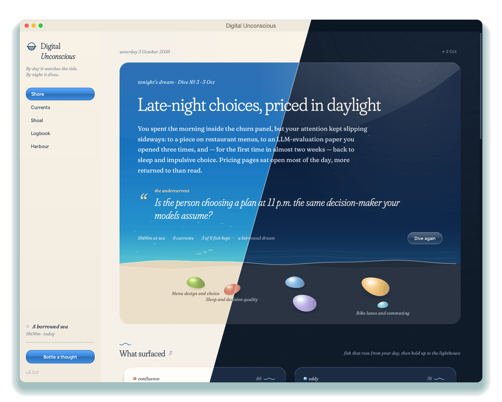
</p>

Some of your best ideas are already in your day. They just sink. You read three things that belong together and
never notice; you circle the same question for weeks without diving in.

**Digital Unconscious** is a small desktop app, imagined as a little sea, that notices. During the day a **tide
watcher** follows where your attention drifts: the window in front of you, the pages you keep returning to, what you
search for, the thoughts you drop into a **bottle**. At night it **dives**. In the morning you find a short
reflection, the one question you seem to be circling, and a few **fish**: ideas that rose from your own day, each
able to say exactly where it came from, each checked by a second model before you see it.

It is for people who think for a living (researchers, writers, builders) and want the half-formed things to surface
instead of sinking.

<table>
  <tr>
    <td width="33%" valign="top">
      <b>It watches; it doesn't stare.</b><br>
      Window titles, pages and real time spent. No screenshots, no keystrokes. Password managers, banks and private
      windows sit in fog and are never recorded.
    </td>
    <td width="33%" valign="top">
      <b>Every fish knows where it rose from.</b><br>
      Ideas must cite the moments of your day they came from. Invented sources are thrown back by code, and a
      different model keeps the lighthouse.
    </td>
    <td width="33%" valign="top">
      <b>Light enough to leave on all day.</b><br>
      0.05% of one CPU core from the menu bar. The sea moves only while you are looking at it, and goes calm on
      battery.
    </td>
  </tr>
</table>

## A day at sea

<table>
  <tr>
    <td width="46%">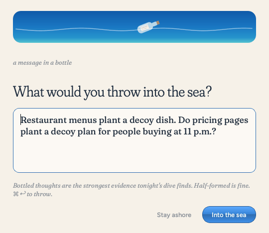</td>
    <td valign="top">
      <h3>Morning: throw a thought into the sea</h3>
      Something half-formed on your mind? Put it in a <b>bottle</b>. Bottles are the strongest evidence a dive gets.
      Papers, notes and text logs can <b>wash ashore</b> too, and an ActivityWatch history can be brought in.
      <br><br>
      Meanwhile the <b>tide watcher</b> glances at the front window every few seconds and lays down a
      <b>driftline</b> with real time attached. At <b>slack water</b> (no keyboard or mouse for a while) it stops
      counting.
    </td>
  </tr>
</table>

### Night: the dive, and in the morning, the shore

<p align="center">
  
</p>

The **Shore** opens on tonight's dream: the Baie des Anges in full sun, a headline for the day, a few honest lines
about where your attention went, and the **undercurrent**, the question you seem to be circling. The day's
**currents** lie on the sand as glossy pebbles: their size is time, and stones that touch met today. A small shoal
crosses the shallows, one fish for each idea that surfaced.

<table>
  <tr>
    <td width="50%"></td>
    <td width="50%">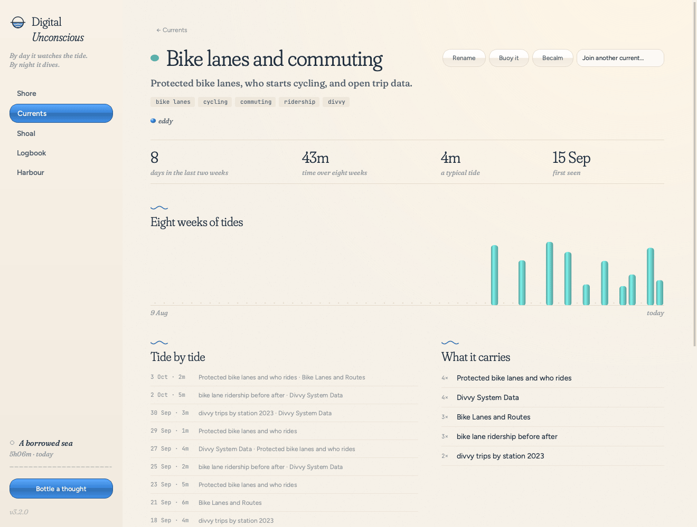</td>
  </tr>
  <tr>
    <td valign="top"><b>Currents.</b> The concerns that keep flowing back, one bead per day. Tonight's
    undercurrents sit above, in plain sentences measured from your tides, never guessed by a model.</td>
    <td valign="top"><b>One current.</b> Eight weeks of tides, what it carried, and the fish it gave. Put a
    <b>buoy</b> on the currents you care about; <b>becalm</b> the ones that are none of its business.</td>
  </tr>
  <tr>
    <td width="50%">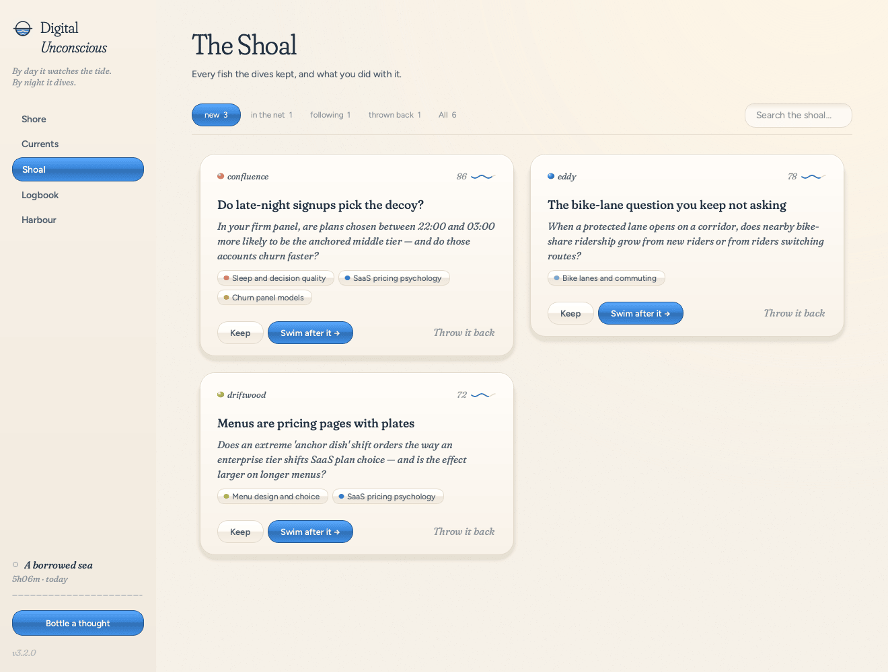</td>
    <td width="50%">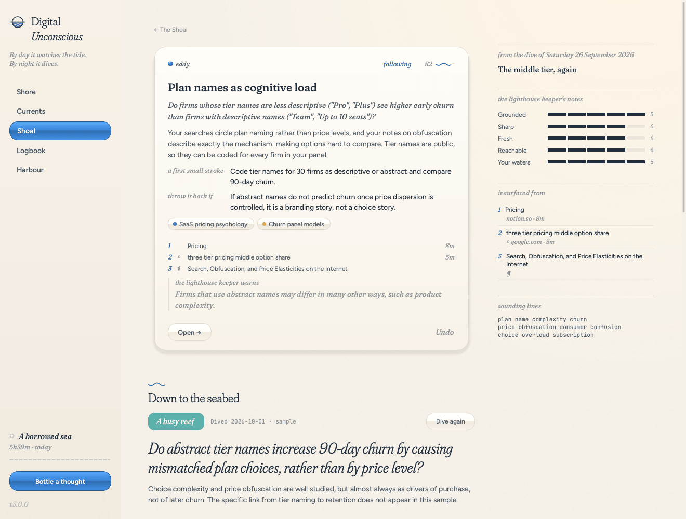</td>
  </tr>
  <tr>
    <td valign="top"><b>The shoal.</b> Every fish the dives kept. Keep one in the net, swim after it, or throw it
    back and say why. Your net steers the next dive.</td>
    <td valign="top"><b>A fish.</b> An answerable question, a <b>first small stroke</b> under two hours, when to
    <b>throw it back</b>, where it rose from, the lighthouse keeper's warning, and a dive to the
    <b>seabed</b> for prior work.</td>
  </tr>
  <tr>
    <td width="50%">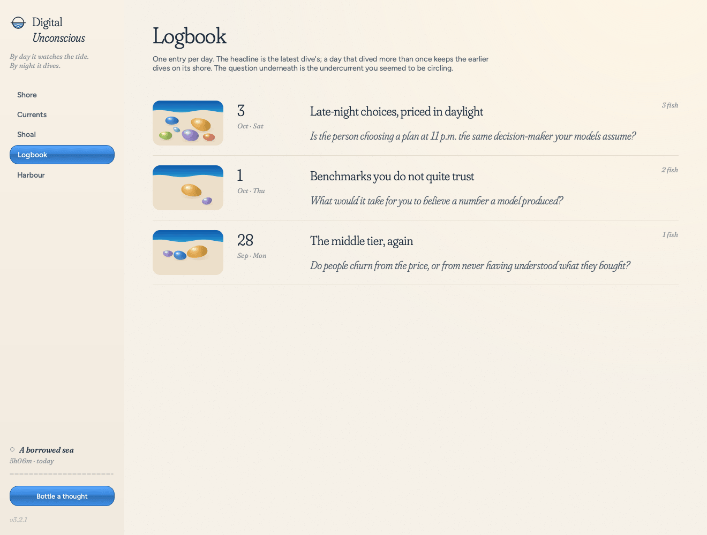</td>
    <td width="50%">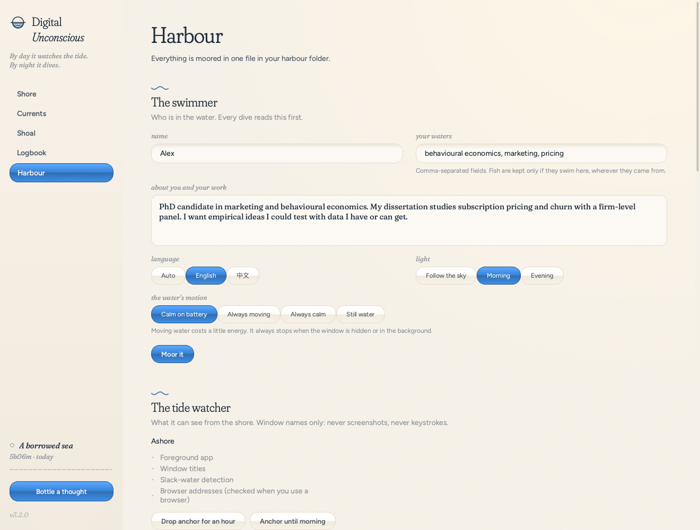</td>
  </tr>
  <tr>
    <td valign="top"><b>Logbook.</b> One entry per night, each with a small picture of that day's shore.</td>
    <td valign="top"><b>Harbour.</b> Who you are and what waters you fish, the crew, the light, the water's motion,
    and exactly what the tide watcher may see.</td>
  </tr>
</table>

<table>
  <tr>
    <td width="46%">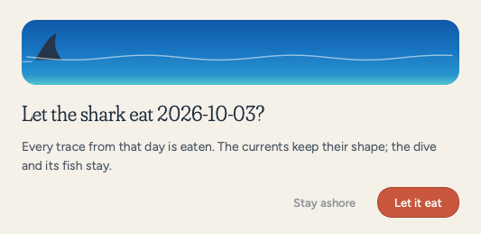</td>
    <td valign="top">
      <h3>And when you want to forget</h3>
      No "purge", no "delete history". You <b>let the shark eat a day</b>, or, if you must,
      <b>feed everything to the sharks</b>. The tide also washes raw driftlines away on its own after 90 days.
    </td>
  </tr>
</table>

## A living sea

<p align="center">
  
  <br>
  
</p>

The look comes from a slow morning in Nice: sun-faded linen, the Mediterranean, ochre and terracotta from the old
town, and a little of the year 2000's glossy gel. By day the dream is pure Nice blue going turquoise over the
pebbles; by evening it is the same bay in deep blue. Small things move slowly: the waterline breathes, a shoal
crosses, a bottle bobs while you write, a fin passes before the shark eats. The fonts (Fraunces, Figtree, JetBrains
Mono) are vendored, so nothing is fetched.

<table>
  <tr>
    <td width="50%">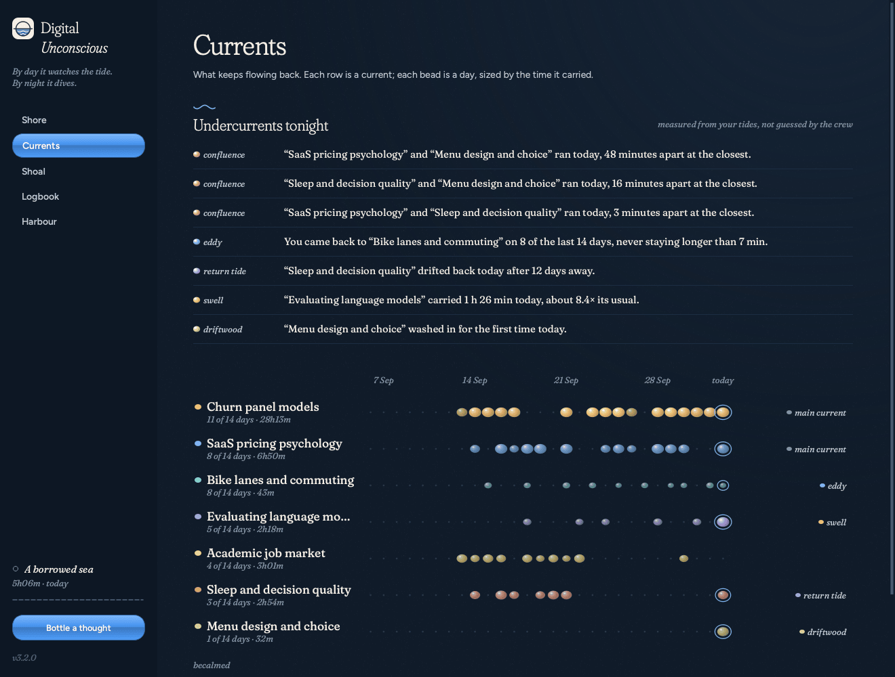</td>
    <td width="50%">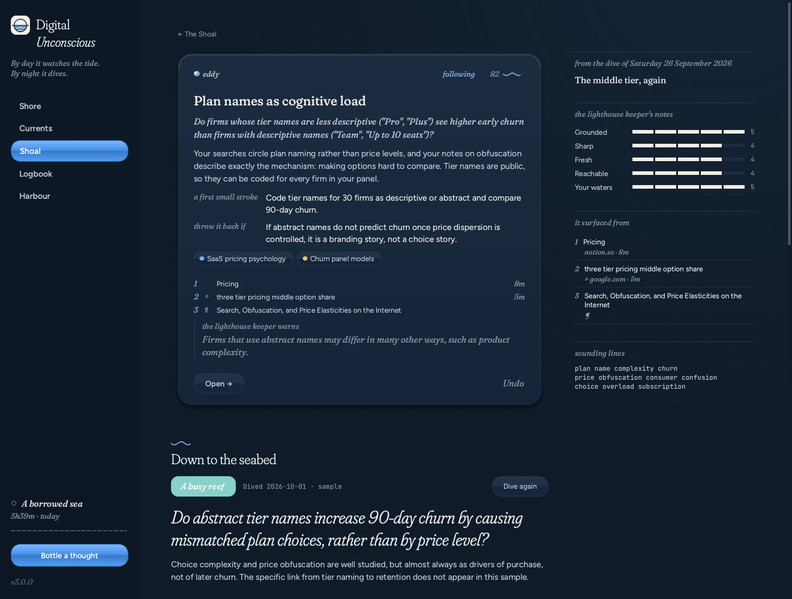</td>
  </tr>
</table>

## How it works

<p align="center">
  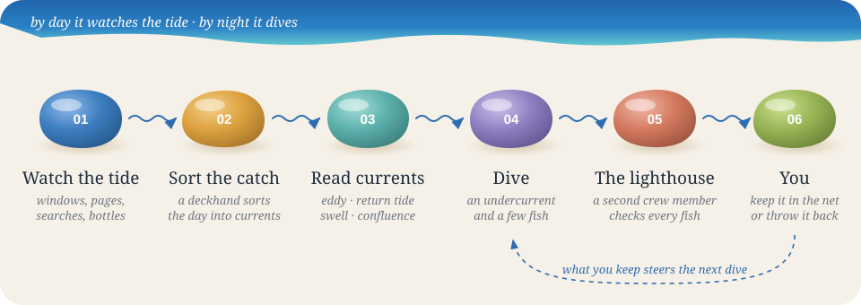
</p>

1. **Watch the tide.** The watcher records the front app, the window title and, where the system allows, the
   browser address, with real dwell time. Chat apps leave only the time they took.
2. **Sort the catch.** A deckhand model groups the day into topics and lets each join a **current**. Code checks
   every reference and joins currents that already exist instead of drawing them twice.
3. **Read the currents.** Plain arithmetic over weeks of tides finds the undercurrents. The crew interprets them; it
   never counts them.

   | Undercurrent | What it means | In code |
   | --- | --- | --- |
   | **eddy** | you come back again and again, never for long: circling without diving in | `orbit` |
   | **return tide** | a current drifted back after a long absence | `return` |
   | **swell** | far more time today than usual | `surge` |
   | **driftwood** | something new washed in, with real time or a bottle behind it | `seed` |
   | **confluence** | two distant currents ran close together today | `collision` |
   | main current · ebb | your known main work, and what has gone quiet | `steady` · `fade` |

4. **Dive.** The strongest diver aboard writes the night's headline, a reflection, the undercurrent question and a
   handful of candidate fish. Each must rise from one movement of the water, name where it rose from, ask an
   answerable question and suggest a first small stroke. A fish that claims water it was never given is thrown back
   by code.
5. **The lighthouse.** A *different* crew member, when one is aboard, scores every fish (grounded, sharp, fresh,
   reachable, in your waters) and writes the strongest warning. Code weighs the light, your taste and a rule against
   catching the same fish twice.
6. **The seabed.** For any fish, *Dive for prior work* sounds OpenAlex and arXiv (both keyless). Citations survive only
   if they point at something that actually came up, and novelty is reported as murk, never as a claim.
7. **Your net.** Keep, follow or throw back, with a reason (*too common*, *caught it before*, *wrong waters*). Your
   net nudges the next dive by at most ±15%.

### A small glossary of the sea

| You see | It is |
| --- | --- |
| **Shore** | today: tonight's dream, what surfaced and what the tide left |
| **Currents** | recurring concerns across weeks, drawn as rows of beads |
| **Shoal** | every idea the dives kept |
| **Logbook** | one entry per night |
| **Harbour** | settings |
| **Pebbles** | the day's currents on the sand: size is time; stones that touch met today |
| **Bottle** · **washed in** | a thought you jot on purpose · a paper or notes you feed it |
| **At anchor** · **slack water** · **fog** | paused · idle · a quiet app it may not look at |
| **The crew** · **the lighthouse** | the language models doing each job · the second opinion |
| **The shark** | forgetting |

## Setting out

**On a Mac.** Download `Digital-Unconscious-<version>.dmg` from the [latest release](https://github.com/shoal-rat/digital-unconscious/releases/latest), open it and drag
**Digital Unconscious** into Applications. It is built for Apple Silicon and signed ad hoc rather than notarized, so the
first time, right-click the app and choose **Open**. macOS then asks once for *Accessibility*, which the tide watcher
needs to read window titles. The same commands work in a terminal through one link:
`ln -s "/Applications/Digital Unconscious.app/Contents/MacOS/Digital Unconscious" ~/.local/bin/dun`.

**From source, anywhere.**

```bash
git clone https://github.com/shoal-rat/digital-unconscious.git
cd digital-unconscious
python -m pip install -e .          # Python 3.11+, installs PySide6
dun demo                            # wade into a borrowed sea first: three weeks of sample memory
dun                                 # then open your own
```

`dun` opens the shore and leaves a small horizon mark in the menu bar (or system tray). Closing the window keeps the
watcher watching and the night's dive scheduled; *Go ashore* in that menu quits. To put the watcher out to sea at
every login: `dun service install`.

**macOS.** Window titles need *Accessibility* permission for the app running Digital Unconscious (System Settings →
Privacy & Security); the first time it reads a browser's address, macOS asks once per browser. `dun doctor` shows
what the watcher can see and who is aboard.
**Linux** needs X11 with `xdotool` (and optionally `xprintidle`); Wayland hides the focused window, so use bottles,
washed-in papers or an ActivityWatch import there. **Windows** sees window titles but not browser addresses.

### The crew

No API key is needed. Sign in once to either subscription CLI and it joins the crew.

| Crew member | How they come aboard | Default jobs |
| --- | --- | --- |
| Claude Code | `claude`, signed in | diving (**Opus 5.5**); sorting the catch, the lighthouse and the seabed (**Sonnet 5.5**) |
| Codex | `codex`, signed in | the lighthouse, so the keeper is not the diver |
| DeepSeek · GLM · Kimi · OpenAI | `DEEPSEEK_API_KEY` · `ZAI_API_KEY` · `MOONSHOT_API_KEY` · `OPENAI_API_KEY` | optional |
| Anthropic API | `ANTHROPIC_API_KEY` and `pip install -e ".[anthropic]"` | optional |
| Ollama, or any OpenAI-compatible server | `[providers.ollama]` in the config | optional, never leaves your machine |

Each job names the hand it prefers and passes to the next if they falter. *Harbour → The crew* shows who takes each
job. `dun doctor --ping` sends every crew member a tiny real errand. A full night on the sample sea (sorting, diving,
the lighthouse) takes a little over a minute with Sonnet 5.5 and Opus 5.5.

**Looking things up.** With *Harbour → The crew → Let Claude look things up* (on by default), Claude may search the web
while it dreams: to understand a concept, to check how two ideas connect, or to see how a topic lives in popular
culture. At the seabed it reads the open-access full texts of what came up, not just the abstracts. Fish still cite only
your day, and seabed citations still name only works that came up. Claude Code's permissions and macOS's sandbox keep
the boundary:

| | |
| --- | --- |
| searching | any query; it runs on Anthropic's side |
| pages and downloads | big sites only: encyclopedias, Reddit, Zhihu, Douban, Bilibili, Weibo, Chinese and English news, film and book sites, scholarly indexes, preprint servers and publishers ([`llm/research.py`](src/unconscious/llm/research.py)); never personal hosting |
| files | one folder per errand; nothing else on your Mac can be read; the folder is deleted when the errand ends |
| spending | a ceiling per errand (about $6 for a dream, $4 at the seabed, as Claude Code counts it) and a 20-minute limit |

A seabed dive that reads four full texts takes about a minute and a half.

**When the crew can't sail, the dive waits instead of failing.**

| What happens | What the sea does |
| --- | --- |
| the connection is in mainland China | Claude, Codex, the Anthropic API and OpenAI stay ashore: nothing is sent to them. The connection is looked up right before every errand, through the same exit the CLIs would take, so a VPN that carries them abroad counts, and switching it off mid-dive is caught. DeepSeek, GLM, Kimi and local models still sail. |
| no network | it cannot tell where the connection is, so it waits (unsure is not abroad) and goes ahead once the network is back |
| Claude or Codex asks to be signed in again | the errand passes to the next crew member, the menu bar tells you once (`claude auth login` / `codex login`), and the sea notices by itself when you have signed in, without a restart |
| a usage limit, a timeout, an overloaded service | a pause that grows (5, 10, 20 minutes… at most two hours), then another try |

None of these spends the night's attempts; only an unusable answer does. *Harbour → The crew* turns the region guard
off or on and says what is keeping anyone in port; `dun doctor` checks it all from the terminal.

## Light on the battery

The sea is meant to stay open on a laptop all day, so it moves the way the Mediterranean does at noon: barely.

- **The tide watcher glances; it does not stare.** On macOS it asks the window server directly instead of running
  AppleScript for every sample (about 0.1 ms instead of 60–100 ms, and no processes spawned). It glances every 15
  seconds while your attention moves, every 30 and then 60 while it rests on one thing, reads only the idle clock at
  slack water, and stretches further on battery. Time is counted from the real clock, so a longer glance changes how
  quickly a switch is noticed, never how much time is counted.
- **The water moves only when you are looking.** Everything that moves shares one clock. It stops when the window is
  hidden, minimised or behind another app; on battery the sea goes calm. Only the waterline is repainted, from
  layers painted once.
- **The window asks for news only when someone is there:** every 5 seconds while open, every 30 from the menu bar.

Share of one CPU core on a MacBook (Apple M5, Retina), sample sea, 45 seconds per case:

| | first v3 build | now |
| --- | --- | --- |
| only the menu-bar mark (window closed) | 1.5% | **0.05%** |
| window open behind other apps | 31.6% | **0.26%** |
| window in front, the water moving | 30.6% | **5.5%** |
| window in front, calm water (the default on battery) | — | **2.9%** |

*Harbour → the water's motion* chooses calm on battery (the default), always moving, always calm or still water.

## Small, and it never forgets the main line

<p align="center">
  
</p>

The harbour tidies itself once a day, and the rule is simple: **details fade, the main line stays.**

- **The main line is never tidied away.** Your currents and each current's day-by-day history, your dreams, your fish
  and your net (what you kept, followed or threw back, and why) are what a dive remembers you by. Housekeeping never
  touches them; only the shark removes them, when you ask.
- **Details fade.** After two weeks, visits to the same thing on the same day merge into one row: same subjects, same
  totals, so nothing a dive reads changes. After 90 days the raw driftline washes away.
- **No day slips through.** A day becomes part of a current's history when it is sorted. If the laptop slept through
  the night, the night watch quietly sorts the days it missed, long before they could wash away.
- **The shark really eats.** Forgetting a day, or everything, gives the space back to the disk. Old job records, the
  crew's call log and the login log are trimmed too.

Two years of heavy use (450 visits a day, a dive every night), same data on both versions:

| | 3.0.0 | now |
| --- | --- | --- |
| after 90 days | 21.0 MB | **12.8 MB** |
| after a year | 27.5 MB | **18.0 MB** |
| after two years | 35.5 MB | **24.4 MB** |
| after feeding everything to the sharks | 35.5 MB | **0.1 MB** |

About 6 MB a year of what remains is the main line itself, your logbook, and it grows only as you dive.
*Harbour → The sea* shows how much the harbour holds. Starting at login, the app waits in the menu bar at about 54 MB
of memory; with the window open, about 130–170 MB, most of it Qt.

## What stays in the harbour

Memory is one SQLite file in `~/.digital-unconscious/` (or `$DUN_HOME`). Only a dive crosses the water: the day's
labels and timings go to the crew when it sorts and dives, and a fish's search lines go to OpenAlex when you dive for
prior work. Claude Code and Codex need no API key, but inference still happens on Anthropic's or OpenAI's side; bring
Ollama aboard to keep every dive at home. The full boundary is in [docs/PRIVACY.md](docs/PRIVACY.md).

## From the command line

The shore is the main way in; the harbour master's terminal works too.

| Command | |
| --- | --- |
| `dun` / `dun app [--hidden]` | open the shore (watcher, menu-bar mark, nightly dive) |
| `dun demo [--language zh]` | open the app on a borrowed sea |
| `dun dream [--day D] [--redigest]` | dive into a day now and print what came up |
| `dun jot "…"` | throw a thought into the sea in a bottle |
| `dun feed FILE…` | let a paper, notes, a text log or an ActivityWatch export wash ashore |
| `dun import-aw [--day D]` | bring in a day from a running ActivityWatch |
| `dun today` · `dun threads` · `dun sparks` | read the shore, the currents and the shoal in the terminal |
| `dun dive FISH_ID` | dive to the seabed for prior work |
| `dun watch` | only the tide watcher, for headless machines |
| `dun doctor [--ping]` | who is aboard, and what the watcher can see |
| `dun config [set section.key value]` | read or change the harbour settings |
| `dun forget --day D` · `--everything` | let the shark eat a day, or feed everything to the sharks |
| `dun service install\|uninstall\|status` | put the watcher out to sea at every login |

## Harbour settings

Everything lives in `config.toml` in the harbour folder; the Harbour page edits the same file.

```toml
[you]                    # the swimmer
persona = "PhD student in health economics. I want empirical questions I can test with public data."
focus = ["health economics", "behavioural economics"]     # your waters
language = "auto"        # auto | en | zh

[sense]                  # the tide watcher
interval_seconds = 15
idle_seconds = 120       # slack water after this long
quiet_apps = ["1Password", "Bitwarden", "Keychain Access"]  # fog
private_apps = ["Messages", "WeChat", "Slack", "Mail"]       # time only
retention_days = 90      # the tide washes driftlines away
battery_saver = true     # glance less often on battery

[dream]                  # night diving
time = "21:30"
auto = true
sparks = 3               # fish kept per dive
candidates = 6           # fish caught before sorting
critique = true          # the lighthouse

[models]                 # the crew: "auto", or e.g. "claude:claude-opus-5-5", "codex", "deepseek:deepseek-v4-pro"
dream = "auto"
critique = "auto"
region_guard = true      # keep Claude, Codex, Anthropic and OpenAI ashore while the connection is in…
hold_regions = ["CN"]    # …these regions
research = true          # let Claude search the web and read papers while it dreams and dives

[ui]
theme = "system"         # system | light (morning) | dark (evening)
motion = "auto"          # auto (calm on battery) | full | calm | off (still water)
```

## For shipwrights

```bash
python -m pip install -e ".[dev,pdf]"
QT_QPA_PLATFORM=offscreen python -m unittest discover -s tests -v
python scripts/snapshots.py snapshots/ [--zh] [--dark]   # paint every page to PNG
python scripts/readme_art.py                             # repaint the pictures in this README
python -m pip install -e ".[mac]" && python scripts/build_mac.py   # Digital Unconscious.app and its .dmg
```

The tests sail offline: a paper crew (an in-process fake model) answers every job. How the ecosystem maps onto the
code is in [docs/ARCHITECTURE.md](docs/ARCHITECTURE.md); contribution notes are in [AGENTS.md](AGENTS.md).

## What changed in v3

v2 had grown into a research-automation framework: a six-stage pipeline that downloaded papers, generated analysis
code and drafted manuscripts; browser automation with a credential vault; prompt self-evolution; seven provider
adapters behind a large router; and a server-rendered dashboard. Most of it was shallow, and the idea it was meant to
serve (noticing what you do not notice) produced generic ideas from a few hourly screenshots.

v3 starts again from that idea:

- **A better tide watcher.** Continuous window and browser sampling with slack-water detection replaces hourly
  screenshots; searches, bottles and washed-in papers count as intent.
- **A sea with memory.** Currents and measured undercurrents give the dive something no single day contains.
- **Honest fish.** Every idea names where it rose from; invented sources are thrown back by code.
- **Catch wide, keep few.** A different crew member keeps the lighthouse; code applies the weights, your net and a
  rule against duplicates.
- **A native app** (PySide6) that lives in the menu bar, instead of a web page.
- **Smaller and stricter.** A standard-library engine, one SQLite file, no browser automation, no stored credentials.
- The command is now `dun` instead of `du`, which shadowed the Unix disk-usage tool. v2's data in `~/.du` is left
  untouched.

<p align="center"><sub>MIT licensed · made for slow mornings by the sea</sub></p>
