<p align="center">
  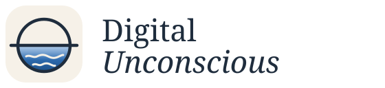
</p>

<p align="center">
  <a href="README.md">English</a> &nbsp;·&nbsp; <b>简体中文</b>
</p>

<h3 align="center">数字潜意识</h3>

<p align="center">
  <em>白天，它看着你的注意力涨潮退潮。<br>夜里，它潜下去，替你捞起那些没被注意到的东西。</em>
</p>

<p align="center">
  <a href="https://github.com/shoal-rat/digital-unconscious/releases/latest"></a>
  
  
  
  <a href="LICENSE"></a>
</p>

<p align="center">
  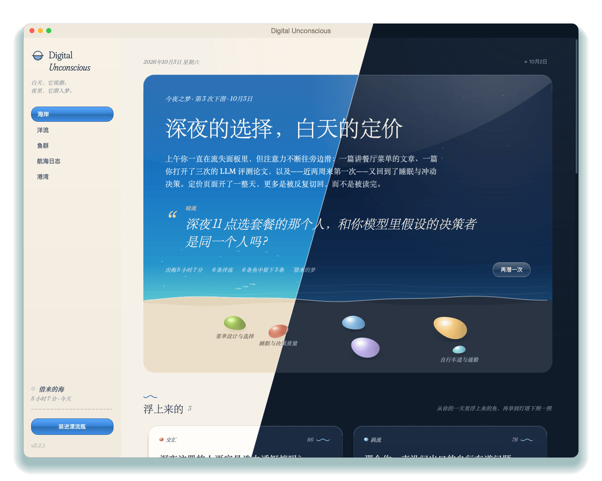
</p>

很多好想法其实早就在你的一天里了，只是沉了下去。你读了三样本该放在一起的东西，却从没发现它们的关联；你绕着同一个问题转了好几个星期，却始终没有潜下去。

**数字潜意识**是一个小小的桌面应用，被想象成一片海，专门替你留意这些。白天，**观潮者**跟着你的注意力漂流：眼前的窗口、反复回去的页面、搜索过的词，还有你随手装进**漂流瓶**的念头。夜里，它**下潜**。第二天早上，你会看到一段简短的反思、一个你似乎一直绕着转的问题，以及几条**鱼**——从你自己的一天里浮上来的想法。每一条都说得清自己从哪里浮上来，也都先被另一个模型照过一遍，才到你面前。

它写给靠思考吃饭的人：研究者、写作者、做东西的人。那些半成形的念头，值得浮上水面，而不是悄悄沉底。

<table>
  <tr>
    <td width="33%" valign="top">
      <b>它只是看看，不会盯着你。</b><br>
      只记窗口标题、页面和真实停留的时间。不截屏，不记键盘。密码管理器、网银和隐私窗口都在雾里，从不记录。
    </td>
    <td width="33%" valign="top">
      <b>每条鱼都知道自己从哪来。</b><br>
      想法必须指明它来自你一天中的哪些时刻。编造出处的鱼会被代码扔回海里，而守灯塔的是另一个模型。
    </td>
    <td width="33%" valign="top">
      <b>轻到可以一整天开着。</b><br>
      只留菜单栏图标时，只占单核 CPU 的 0.05%。海面只在你看着它时才流动，用电池时会更平静。
    </td>
  </tr>
</table>

## 海上的一天

<table>
  <tr>
    <td width="46%">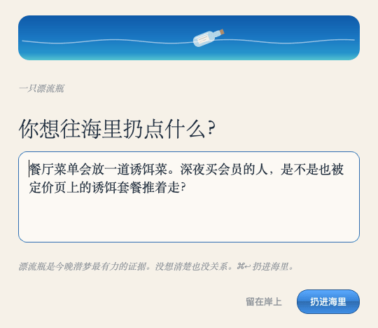</td>
    <td valign="top">
      <h3>早上：往海里扔点什么</h3>
      脑子里有个没想清楚的念头？装进<b>漂流瓶</b>。漂流瓶是下潜时最有力的证据。论文、笔记和文本日志也可以<b>冲上岸</b>，ActivityWatch 的历史记录也能导进来。
      <br><br>
      与此同时，<b>观潮者</b>每隔几秒看一眼眼前的窗口，记下一条带着真实时长的<b>漂流线</b>。到了<b>平潮</b>（一段时间没碰键盘鼠标），它就停止计时。
    </td>
  </tr>
</table>

### 夜里下潜，早上回到海岸

<p align="center">
  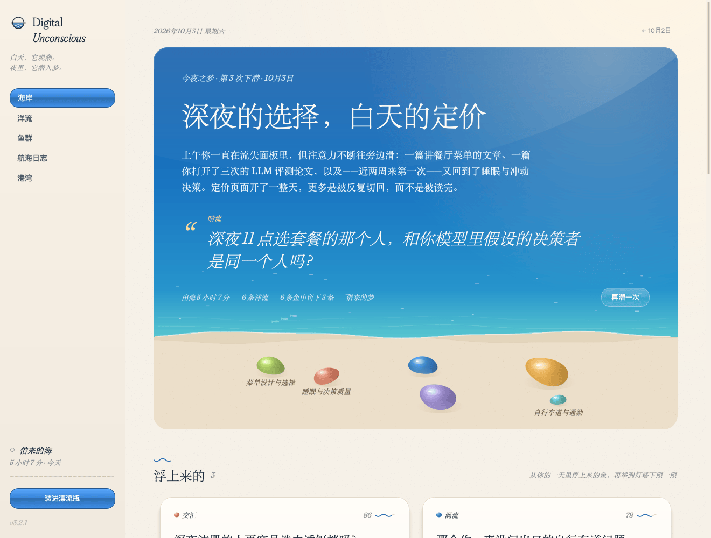
</p>

**海岸**上是今夜之梦：阳光下的天使湾，一个为这一天起的标题，几句关于你注意力去向的坦白话，还有**暗流**——那个你似乎一直绕着转的问题。当天的**洋流**化作沙滩上一把亮晶晶的鹅卵石：大小代表时间，相触的石头今天相遇过。浅水里游过一小群鱼，每一条代表一个浮上来的想法。

<table>
  <tr>
    <td width="50%">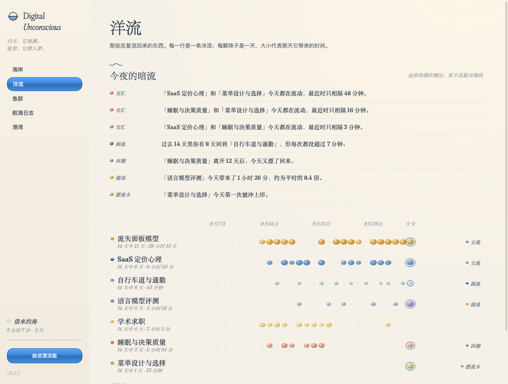</td>
    <td width="50%">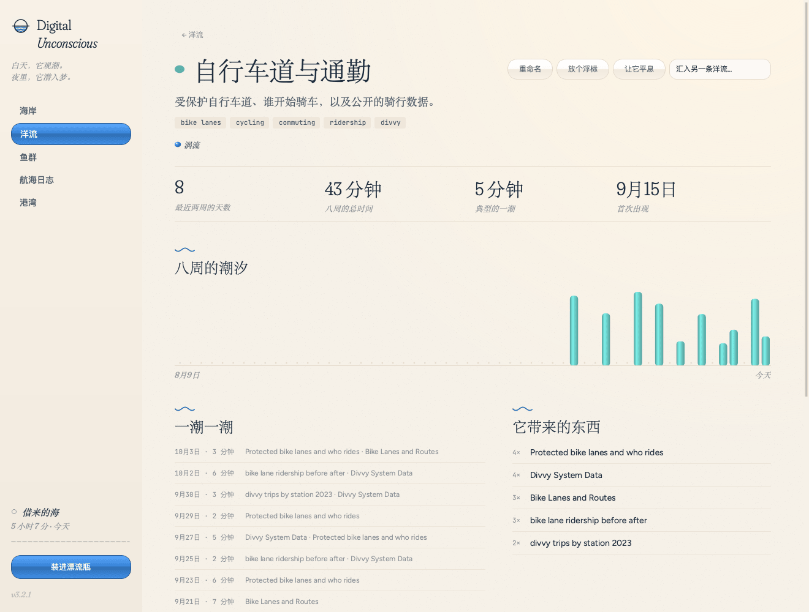</td>
  </tr>
  <tr>
    <td valign="top"><b>洋流。</b>那些反复流回来的东西，一天一颗珠子。上方是今夜的暗流，用平实的句子写出，全部由你的潮汐测出，而不是模型猜的。</td>
    <td valign="top"><b>一条洋流。</b>八周的潮汐、它带来的东西、它给出的鱼。在你在意的洋流上<b>放个浮标</b>；与它无关的，就<b>让它平息</b>。</td>
  </tr>
  <tr>
    <td width="50%">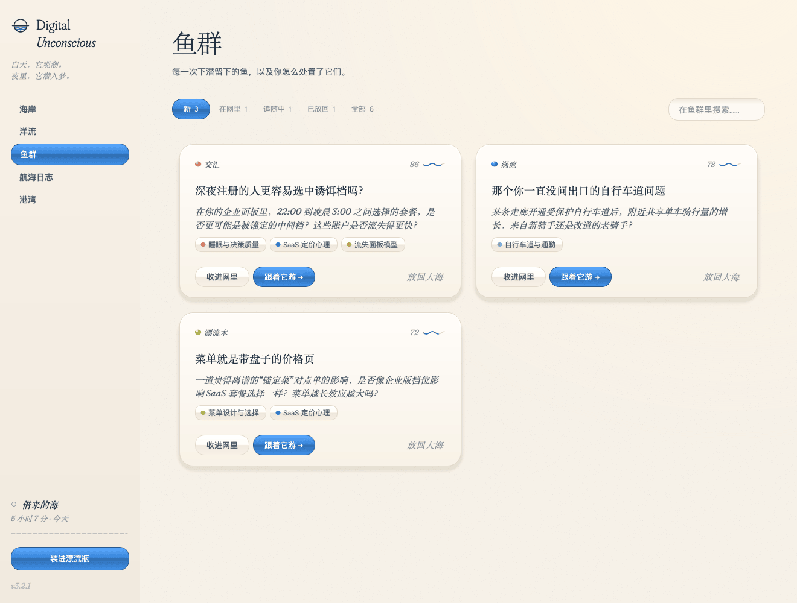</td>
    <td width="50%">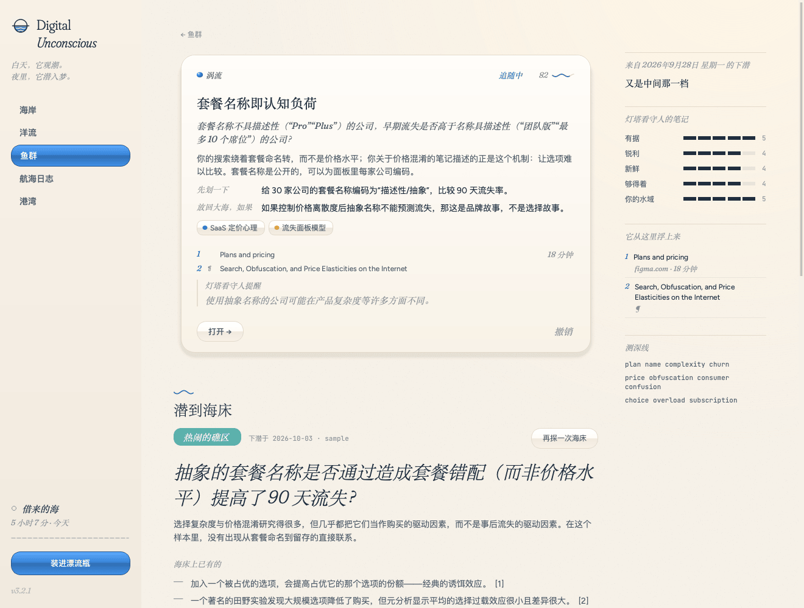</td>
  </tr>
  <tr>
    <td valign="top"><b>鱼群。</b>每次下潜留下的鱼。收进网里、跟着它游，或者放回大海并说明理由。你的网会影响下一次下潜。</td>
    <td valign="top"><b>一条鱼。</b>一个能回答的问题，两小时内就能做的<b>先划一下</b>，什么情况下该<b>放回大海</b>，它从哪里浮上来，灯塔看守人的提醒，还可以<b>潜到海床</b>找已有文献。</td>
  </tr>
  <tr>
    <td width="50%">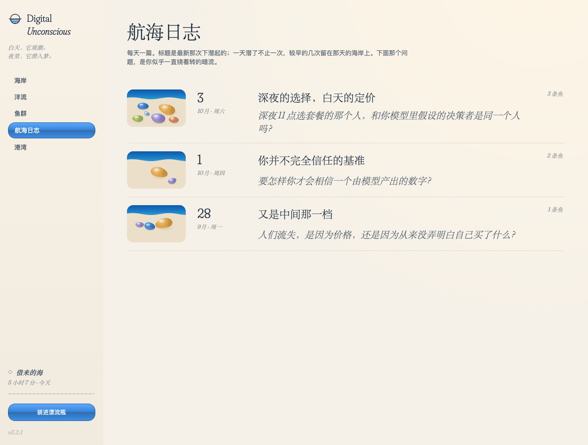</td>
    <td width="50%">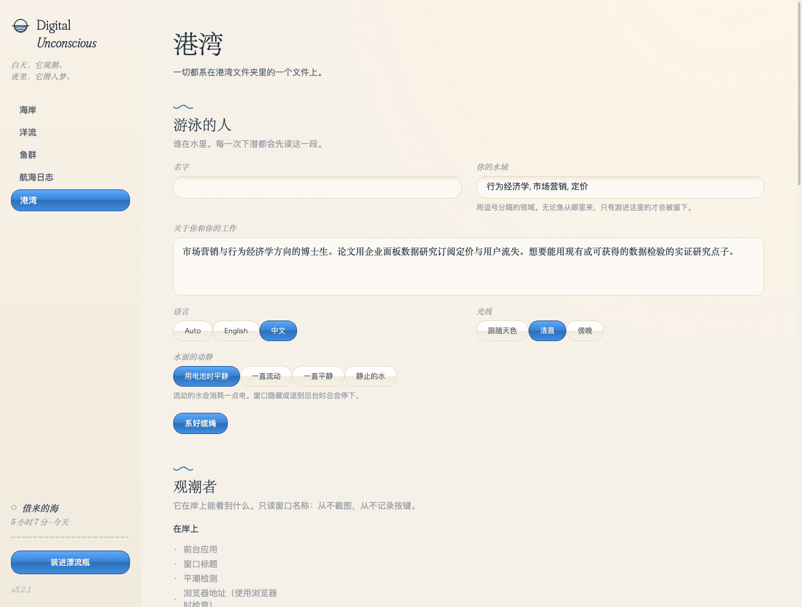</td>
  </tr>
  <tr>
    <td valign="top"><b>航海日志。</b>每天一篇，每篇配一张当天海岸的小图。一天潜了两次，最新的一次在前，较早的那次完整地收在那天的海岸上。</td>
    <td valign="top"><b>港湾。</b>你是谁、在哪片水域钓鱼、船员、光线、水面的动静，以及观潮者到底能看见什么。</td>
  </tr>
</table>

<table>
  <tr>
    <td width="46%">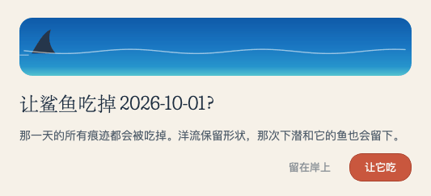</td>
    <td valign="top">
      <h3>想遗忘的时候</h3>
      这里没有“清除”，也没有“删除历史”。你只需要<b>让鲨鱼吃掉这一天</b>；真想彻底忘掉，就<b>把一切喂给鲨鱼</b>。原始的漂流线 90 天后也会被潮水自己冲走。
    </td>
  </tr>
</table>

## 一片会呼吸的海

<p align="center">
  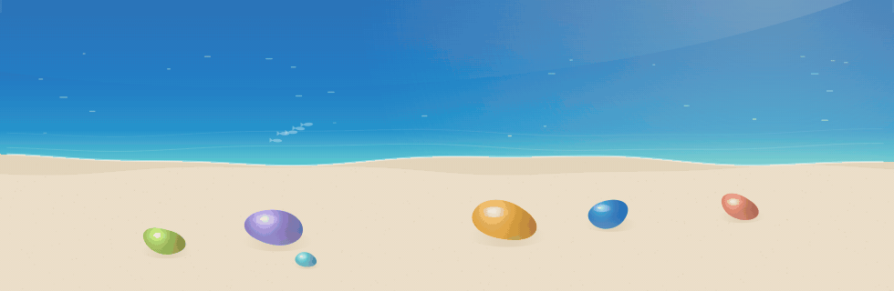
  <br>
  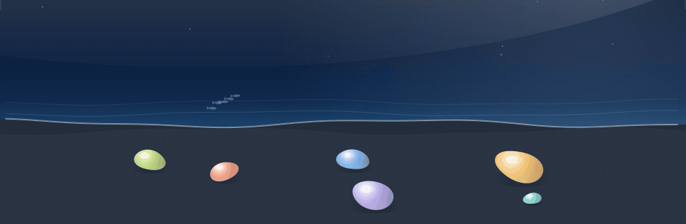
</p>

它的样子来自尼斯一个慵懒的早晨：在南法的小别墅里醒来，去海边走一圈，回来睡个回笼觉，潜意识慢慢浮上来。褪色的亚麻、地中海、老城的赭石色与赤陶色，再加一点千禧年的果冻光泽。白天的梦是纯正的尼斯蓝，在鹅卵石上渐变成绿松石色；傍晚则是同一片海湾，换成了深蓝。小东西都慢慢地动：海浪线在呼吸，一小群鱼游过，你写字时漂流瓶在浪上晃，鲨鱼吃东西前会先露出一片鳍。字体（Fraunces、Figtree、JetBrains Mono）随应用打包，中文标题回退到宋体，不需要联网下载。

<table>
  <tr>
    <td width="50%">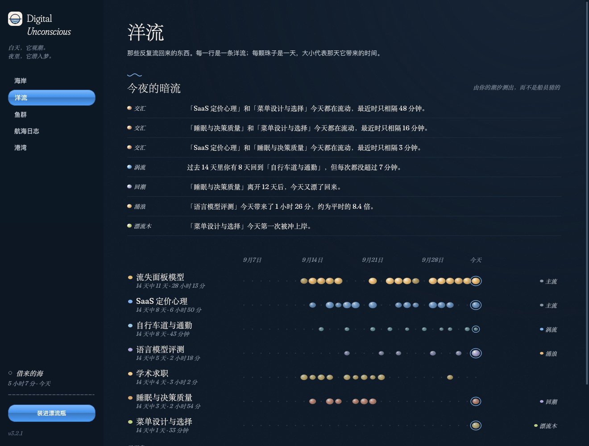</td>
    <td width="50%">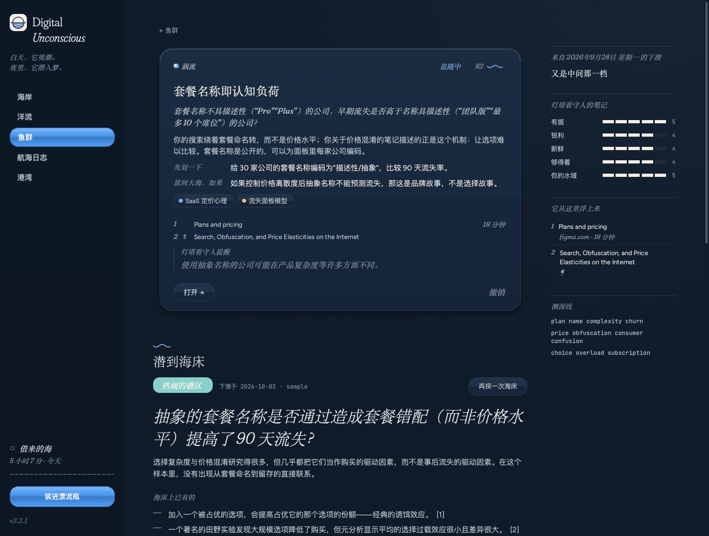</td>
  </tr>
</table>

## 它是怎么工作的

<p align="center">
  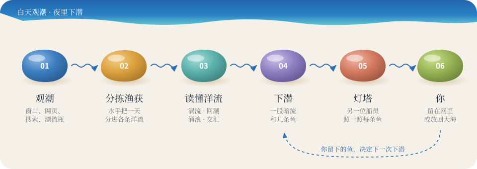
</p>

1. **观潮。** 观潮者记下前台应用、窗口标题，以及系统允许时的浏览器地址，附上真实的停留时长。聊天软件只留下花掉的时间。
2. **分拣渔获。** 一位水手模型把一天分成几个主题，让每个主题汇入一条**洋流**。代码会核对每一处引用；已经存在的洋流会被汇入，而不是重画一条。
3. **读懂洋流。** 暗流是用几周潮汐的简单算术测出来的。船员负责解读，从不负责计数。

   | 暗流 | 含义 | 代码里 |
   | --- | --- | --- |
   | **涡流** | 你一次次回来，每次都不久：一直在绕，却没潜下去 | `orbit` |
   | **回潮** | 一条洋流离开很久之后又漂了回来 | `return` |
   | **涌浪** | 今天花的时间远超平常 | `surge` |
   | **漂流木** | 有新东西冲上岸，背后有真实的时间或一只漂流瓶 | `seed` |
   | **交汇** | 两条相距很远的洋流今天靠得很近 | `collision` |
   | 主流 · 退潮 | 你已知的主线工作，以及渐渐安静下去的东西 | `steady` · `fade` |

4. **下潜。** 船上最强的潜者写下今夜的标题、一段反思、暗流问题和几条候选的鱼。每条鱼都必须来自一处具体的水流变化，说清从哪里浮上来，提出一个能回答的问题，并给出先划一下的那一步。声称来自从未给过它的水域的鱼，会被代码扔回海里。
5. **灯塔。** 船上有另一位船员时，由*另一位*来给每条鱼打分（有根据吗？够锋利吗？够新吗？够得着吗？在你的水域里吗？），并写下最尖锐的提醒。权重、你的口味，以及“不钓同一条鱼两次”的规则，都由代码执行。
6. **海床。** 对任何一条鱼，都可以*潜下去找文献*：探测 OpenAlex 和 arXiv（都不需要 key）。只有真正检索到的文献才会被保留为引用；新颖性只会描述为“水有多浑”，从不下断言。
7. **你的网。** 收进网里、跟着它游，或者放回大海，并说明理由（*太常见的鱼*、*以前钓到过*、*误读了我的潮汐*……）。你的网对下一次下潜的影响最多 ±15%。

### 海的小词典

| 你看到的 | 它是什么 |
| --- | --- |
| **海岸** | 今天：今夜之梦、浮上来的鱼、潮水留下的东西 |
| **洋流** | 跨越数周、反复出现的关注点，画成一行行珠子 |
| **鱼群** | 每次下潜留下的想法 |
| **航海日志** | 每天一篇；一天里较早的下潜收在那天的海岸上 |
| **港湾** | 设置 |
| **鹅卵石** | 沙滩上当天的洋流：大小是时间，相触的石头今天相遇 |
| **漂流瓶** · **冲上岸** | 你特意记下的念头 · 你喂给它的论文或笔记 |
| **下锚** · **平潮** · **起雾** | 暂停 · 空闲 · 它不该看的安静应用 |
| **船员** · **灯塔** | 负责各项工作的语言模型 · 第二意见 |
| **鲨鱼** | 遗忘 |

## 出海

**在 Mac 上。** 从[最新版本](https://github.com/shoal-rat/digital-unconscious/releases/latest)下载 `Digital-Unconscious-<版本>.dmg`，打开后把 **Digital Unconscious** 拖进「应用程序」。它为 Apple 芯片构建，只做了临时签名、没有经过公证，所以第一次打开时请右键点应用、选择**打开**。之后 macOS 会询问一次*辅助功能*权限，观潮者需要它来读取窗口标题。终端里的命令也能照常用，只要建一个链接：`ln -s "/Applications/Digital Unconscious.app/Contents/MacOS/Digital Unconscious" ~/.local/bin/dun`。

**从源码安装（任何系统）。**

```bash
git clone https://github.com/shoal-rat/digital-unconscious.git
cd digital-unconscious
python -m pip install -e .          # 需要 Python 3.11+，会自动安装 PySide6
dun demo --language zh              # 先在一片借来的海里看看：三周的示例记忆
dun                                 # 然后打开你自己的海
```

`dun` 会打开海岸，并在菜单栏（或系统托盘）留下一个小小的地平线图标。关掉窗口，观潮者照样观潮，夜里的下潜照常进行；在那个菜单里选*上岸*才会退出。想让它每次登录都安静地在菜单栏里出海：在 macOS 和 Linux 上，到*港湾 → 观潮者*里勾上*每次登录时出海*（或运行 `dun service install`；在 Windows 上它会说明如何添加启动快捷方式）。

**macOS：** 读取窗口标题需要给运行它的应用开启*辅助功能*权限（系统设置 → 隐私与安全性）；第一次读取浏览器地址时，macOS 会为每个浏览器询问一次。`dun doctor` 能看到观潮者能看见什么、船上都有谁。
**Linux** 需要 X11 和 `xdotool`（可选 `xprintidle`）；Wayland 不公开前台窗口，那里请用漂流瓶、冲上岸的论文或 ActivityWatch 导入。**Windows** 能看到窗口标题，但看不到浏览器地址。

### 船员

不需要 API key。登录任意一个订阅制命令行工具，它就会加入船员。

| 船员 | 怎么上船 | 默认负责 |
| --- | --- | --- |
| Claude Code | 登录 `claude` | 下潜（**Opus 5.5**）；分拣渔获、灯塔和海床（**Sonnet 5.5**） |
| Codex | 登录 `codex` | 灯塔，这样守灯塔的就不是潜者本人 |
| DeepSeek · 智谱 GLM · Kimi · OpenAI | `DEEPSEEK_API_KEY` · `ZAI_API_KEY` · `MOONSHOT_API_KEY` · `OPENAI_API_KEY` | 可选 |
| Anthropic API | `ANTHROPIC_API_KEY`，并 `pip install -e ".[anthropic]"` | 可选 |
| Ollama 或任何 OpenAI 兼容服务 | 在配置里写 `[providers.ollama]` | 可选，数据不离开本机 |

每项工作都有首选的人手，对方失手就交给下一位。*港湾 → 船员*里能看到每项工作由谁接手。`dun doctor --ping` 会给每位船员派一个很小的真实差事。在示例海上跑完完整的一夜（分拣、下潜、灯塔），用 Sonnet 5.5 和 Opus 5.5 只需一分钟多一点。

**查资料。** 打开*港湾 → 船员 → 下潜时允许 Claude 上网查概念、下载论文全文来读*（默认开启）后，Claude 做梦时可以上网搜索：弄懂一个概念，查两个想法之间有没有联系，或者看看一个话题在流行文化里是什么样子。潜到海床时，它会读捞上来的论文的开放获取全文，而不只是摘要。鱼仍然只引用你的一天，海床上的引用也仍然只指向真正检索到的文献。边界由 Claude Code 的权限和 macOS 的沙箱守着：

| | |
| --- | --- |
| 搜索 | 任何关键词；在 Anthropic 那一侧进行 |
| 网页和下载 | 只限大型网站：百科、Reddit、知乎、豆瓣、B 站、微博、中英文新闻、影视书籍网站、学术索引、预印本和出版社（[`llm/research.py`](src/unconscious/llm/research.py)）；绝不包括个人托管的站点 |
| 文件 | 每次差事一个文件夹；Mac 上的其他文件一律读不到；差事结束就删除 |
| 花费 | 每次差事有上限（按 Claude Code 的计算，做梦约 6 美元，海床约 4 美元），并且最长 20 分钟 |

一次读四篇全文的海床下潜，大约一分半钟。

**船员出不了海时，下潜会等待，而不是失败。**

| 发生了什么 | 这片海怎么做 |
| --- | --- |
| 网络位于中国大陆 | Claude、Codex、Anthropic API 和 OpenAI 留在岸上，什么都不会发给它们。每次出航前都会按命令行工具实际会走的网络出口重新检查一次：带它们出境的 VPN 算数，下潜中途关掉 VPN 也会被发现。DeepSeek、智谱、Kimi 和本地模型照常出航。 |
| 断网 | 判断不了网络所在地，就先等着（不确定不等于在境外），网络恢复后自动继续 |
| Claude 或 Codex 要求重新登录 | 这件差事交给下一位船员，菜单栏提醒你一次（`claude auth login` / `codex login`），你登录后它会自己发现，不用重启 |
| 用量上限、超时、服务过载 | 先歇一会儿再试，间隔逐步拉长（5、10、20 分钟……最多两小时） |

这些情况都不会消耗当晚的下潜次数，只有无法使用的回答才算。在*港湾 → 船员*里可以开关这道区域防线，也能看到是什么让船员留在港里；`dun doctor` 能在终端里检查这一切。

## 不费电

这片海是为一整天开着的笔记本准备的，所以它动起来，像正午的地中海：几乎不动。

- **观潮者只是瞥一眼，不会一直盯着。** 在 macOS 上，它直接询问窗口服务器，不再每次都运行 AppleScript（每次约 0.1 毫秒，原来要 60–100 毫秒，而且不再启动新进程）。注意力在变动时每 15 秒看一眼；停在同一件事上，就放慢到 30 秒、再到 60 秒；平潮时只看空闲时钟；用电池时整体再放慢。时间按真实时钟计算，看得少只会让它稍晚发现切换，绝不会少算你的时间。
- **只有你在看时，海才会动。** 所有会动的东西共用一个时钟。窗口隐藏、最小化或退到其他应用后面时，它就停下；用电池时海面会变平静。每一帧只重画海浪线那一条，其余画面都用画好一次的图层。
- **窗口只在有人看时才频繁刷新：** 打开时每 5 秒一次，只剩菜单栏图标时每 30 秒一次。

在 MacBook（Apple M5，Retina 屏）上用示例海实测，每种情况 45 秒，数字是单核 CPU 占用：

| | v3 初版 | 现在 |
| --- | --- | --- |
| 只留菜单栏图标（窗口关闭） | 1.5% | **0.05%** |
| 窗口开着，但在其他应用后面 | 31.6% | **0.26%** |
| 窗口在前台，海面流动 | 30.6% | **5.5%** |
| 窗口在前台，平静的海（用电池时的默认） | — | **2.9%** |

在*港湾 → 水面的动静*里可以选：用电池时平静（默认）、一直流动、一直平静、静止的水。

## 小而美，但从不忘记你的主线

<p align="center">
  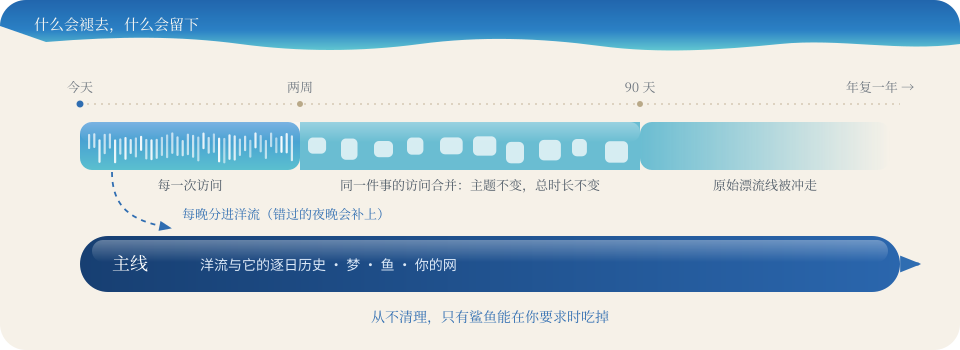
</p>

港湾每天自己整理一次，规则很简单：**细节会褪去，主线会留下。**

- **主线从不清理。** 你的洋流和每条洋流的逐日历史、你的梦、你的鱼，还有你的网（收下了什么、跟着游了什么、放回了什么，以及为什么），是下潜记住你的方式。整理永远不碰它们；只有你开口时，鲨鱼才会吃掉。
- **细节会褪去。** 两周后，同一天里对同一件事的多次访问会合并成一行：主题不变，总时长不变，下潜读到的东西一点都没变。90 天后，原始漂流线被潮水冲走。
- **没有哪一天会漏掉。** 一天只有被分拣过，才会写进洋流的历史。如果笔记本整夜都在睡，守夜人会悄悄把错过的日子补分进洋流，远在它们被冲走之前；一天下潜之后才进来的那几个小时，也会补分进去。下午手动潜过一次，夜里只有在这天又多了不少（多出半小时以上，或有新的漂流瓶）时才会再潜；否则只把晚上的内容分进洋流。
- **鲨鱼是真的会吃。** 遗忘某一天或全部遗忘后，空间会真正还给磁盘。旧的任务记录、船员的调用日志和登录日志也会定期修剪。

两年的重度使用（每天 450 次访问、每晚一次下潜），同一份数据在两个版本上的对比：

| | 3.0.0 | 现在 |
| --- | --- | --- |
| 90 天后 | 21.0 MB | **12.8 MB** |
| 一年后 | 27.5 MB | **18.0 MB** |
| 两年后 | 35.5 MB | **24.4 MB** |
| 把一切喂给鲨鱼之后 | 35.5 MB | **0.1 MB** |

剩下的部分里，每年大约 6 MB 是主线本身，也就是你的航海日志，只会随着下潜慢慢变厚。*港湾 → 大海*里能看到港湾里存了多少。登录时启动的话，它在菜单栏里只占约 54 MB 内存；打开窗口时约 130–170 MB，大部分是 Qt 本身。

## 什么留在港湾里

所有记忆都是 `~/.digital-unconscious/`（或 `$DUN_HOME`）里的一个 SQLite 文件。只有下潜会越过海面：分拣和下潜时，当天的标签和时长会发给船员；你潜到海床找文献时，这条鱼的测深线会发给 OpenAlex。Claude Code 和 Codex 不需要 API key，但推理仍然发生在 Anthropic 或 OpenAI 那一侧；想让每次下潜都留在家里，请让 Ollama 上船。完整的边界见 [docs/PRIVACY.md](docs/PRIVACY.md)（英文）。

## 命令行

海岸是主要入口，港务长的终端也能用。

| 命令 | |
| --- | --- |
| `dun` / `dun app [--hidden]` | 打开海岸（观潮者、菜单栏图标、夜里的下潜） |
| `dun demo [--language zh]` | 在一片借来的海上打开应用 |
| `dun dream [--day D] [--redigest]` | 现在就潜入某一天，并打印浮上来的东西 |
| `dun jot "…"` | 把一个念头装进漂流瓶扔进海里 |
| `dun feed FILE…` | 让论文、笔记、文本日志或 ActivityWatch 导出冲上岸 |
| `dun import-aw [--day D]` | 从正在运行的 ActivityWatch 导入一天 |
| `dun today` · `dun threads` · `dun sparks` | 在终端里看海岸、洋流和鱼群 |
| `dun dive FISH_ID` | 为一条鱼潜到海床找文献 |
| `dun watch` | 只运行观潮者，适合没有界面的机器 |
| `dun doctor [--ping]` | 船上有谁，观潮者能看见什么 |
| `dun config [set section.key value]` | 查看或修改港湾设置 |
| `dun forget --day D` · `--everything` | 让鲨鱼吃掉某一天，或把一切喂给鲨鱼 |
| `dun service install\|uninstall\|status` | 让观潮者每次登录都自动出海 |

## 港湾设置

所有设置都在港湾文件夹的 `config.toml` 里；港湾页面改的也是这个文件。

```toml
[you]                    # 游泳的人
persona = "健康经济学博士生。我想要能用公开数据检验的实证问题。"
focus = ["健康经济学", "行为经济学"]     # 你的水域
language = "zh"          # auto | en | zh

[sense]                  # 观潮者
interval_seconds = 15
idle_seconds = 120       # 多久没动静算平潮
quiet_apps = ["1Password", "Bitwarden", "Keychain Access"]  # 起雾
private_apps = ["Messages", "WeChat", "Slack", "Mail"]       # 只记时间
retention_days = 90      # 漂流线保留多久
battery_saver = true     # 用电池时少看几眼

[dream]                  # 夜里下潜
time = "21:30"
auto = true
sparks = 3               # 每次下潜留下几条鱼
candidates = 6           # 挑选前先钓几条
critique = true          # 灯塔

[models]                 # 船员："auto"，或如 "claude:claude-opus-5-5"、"codex"、"deepseek:deepseek-v4-pro"
dream = "auto"
critique = "auto"
region_guard = true      # 网络位于下列地区时，让 Claude、Codex、Anthropic 和 OpenAI 留在岸上
hold_regions = ["CN"]
research = true          # 做梦和下潜时允许 Claude 上网查资料、读论文

[ui]
theme = "system"         # system | light（白天）| dark（夜晚）
motion = "auto"          # auto（用电池时平静）| full | calm | off（静止的水）
```

## 造船的人

```bash
python -m pip install -e ".[dev,pdf]"
QT_QPA_PLATFORM=offscreen python -m unittest discover -s tests -v
python scripts/snapshots.py snapshots/ [--zh] [--dark]   # 把每个页面画成 PNG
python scripts/readme_art.py                             # 重新绘制 README 里的图片
python -m pip install -e ".[mac]" && python scripts/build_mac.py   # 打包 Digital Unconscious.app 和 .dmg
```

测试完全离线：一位纸做的船员（进程内的假模型）负责回答每项工作。这片海的生态如何对应到代码，见 [docs/ARCHITECTURE.md](docs/ARCHITECTURE.md)（英文）；贡献说明见 [AGENTS.md](AGENTS.md)（英文）。

## v3 有什么不同

v2 渐渐长成了一个科研自动化框架：下载论文、生成分析代码、起草论文的六阶段流水线，带凭据保险箱的浏览器自动化，会自我进化的提示词，七个模型适配器加一个庞大的路由，还有一个服务器渲染的网页仪表盘。大多流于表面，而它本该服务的那个想法——留意你没留意到的东西——却只能从每小时一张截图里得出泛泛的点子。

v3 从这个想法重新出发：

- **更好的观潮者。** 用持续的窗口与浏览器采样和平潮检测，取代每小时一张截图；搜索、漂流瓶和冲上岸的论文都被视为意图。
- **一片有记忆的海。** 洋流和测出来的暗流，给了下潜单独一天给不了的东西。
- **诚实的鱼。** 每个想法都说清从哪里浮上来；编造的出处会被代码扔回海里。
- **广撒网，少留鱼。** 由另一位船员守灯塔；权重、你的网和去重规则由代码执行。
- **原生应用**（PySide6），住在菜单栏里，而不是一个网页。
- **更小，更严格。** 标准库引擎，一个 SQLite 文件，没有浏览器自动化，不保存任何凭据。
- 命令从 `du` 改成了 `dun`（原来的名字会遮住 Unix 的磁盘占用命令）。v2 在 `~/.du` 里的数据原封不动。

<p align="center"><sub>MIT 许可 · 为海边慵懒的早晨而做</sub></p>
