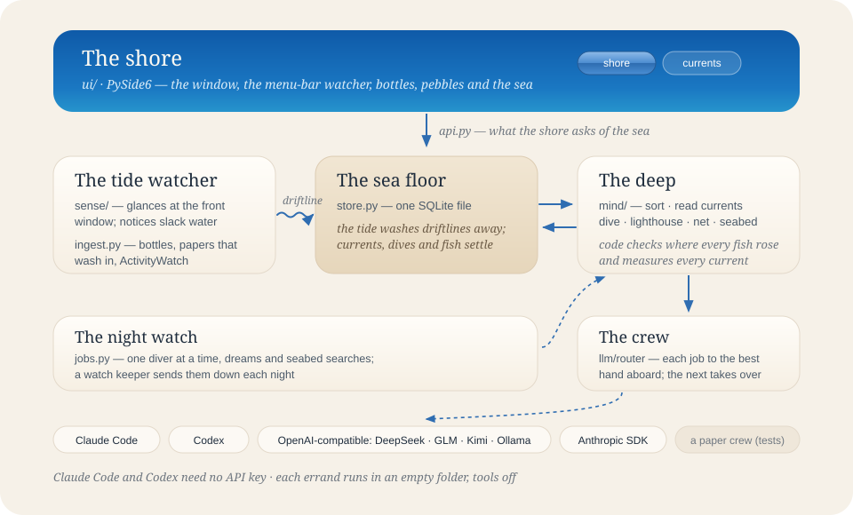
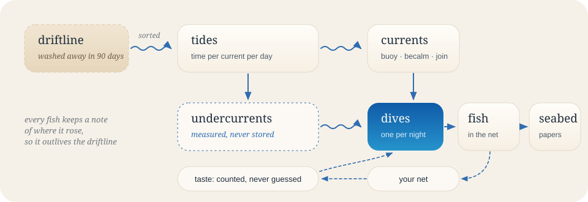
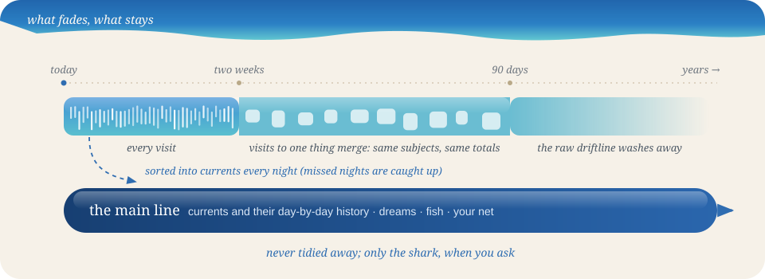

# The ecosystem, in code

Digital Unconscious is imagined as a small sea, and the code is laid out along the same shoreline. People read the
ocean names; the code keeps plain ones, so a contributor always knows both.

Everything runs in one process on one machine. Nothing lives on a server.

## Who lives where

| In the sea | In the code | What it does |
| --- | --- | --- |
| **The shore** | `ui/` | The PySide6 window, the menu-bar mark, the bottle and shark dialogs, the painted sea, pebbles and beads |
| what the shore asks of the sea | `api.py` | View models: plain dicts the shore and the terminal render |
| **The tide watcher** | `sense/sensors.py`, `sense/watcher.py` | Glances at the front window every few seconds (macOS osascript and ioreg, Win32 via ctypes, X11 xdotool); turns glances into a driftline with real time; stops counting at slack water; rolls over at midnight; lets the tide wash old driftlines away |
| fog and time-only waters | `sense/privacy.py` | What is never recorded (quiet apps and sites, private windows) and what is blurred (addresses, numbers, tokens) |
| reading the driftline | `sense/subjects.py` | Raw glance → subject: tidy titles, find searches, recognise papers and code projects |
| things that wash in | `ingest.py` | Bottles (jots), papers and notes, plain text logs, JSON records, ActivityWatch |
| **The sea floor** | `store.py` | One SQLite file (WAL). Short-lived connections, so the watcher, the shore and the terminal never block each other |
| the harbour settings | `config.py` | One TOML file, edited by the Harbour page and by hand |
| **The deep** | `mind/` | Everything that happens below the surface at night |
| sorting the catch | `mind/digest.py` | A day's subjects → topics → currents; checks every reference, joins existing currents instead of redrawing them, writes the day atomically |
| reading the currents | `mind/signals.py` | Eddy, return tide, swell, driftwood, confluence, main current, ebb: arithmetic over weeks of tides |
| the dive | `mind/dream.py` | Context → dream → checking where each fish rose → the lighthouse → weighing → keeping a few → bringing it ashore |
| the lighthouse | inside `mind/dream.py` | A second crew member scores each fish and writes a warning; code applies the weights |
| your net | `mind/taste.py` | Counts of what you kept and threw back; a bounded nudge to ranking and a paragraph for the next dive |
| the seabed | `mind/dive.py`, `scholar.py` | OpenAlex (then arXiv) soundings plus one crew call; citations must point at something that came up |
| what the crew is told | `mind/prompts.py` | Every prompt and answer shape, in one place |
| **The crew** | `llm/router.py`, `llm/providers.py` | Each job names the hand it prefers; the first one aboard takes it, the next takes over if they falter |
| a paper crew | `llm/fake.py` | A deterministic stand-in so the tests and `DUN_FAKE_LLM=1` sail offline |
| **The night watch** | `jobs.py` | One diver at a time (subscription CLIs are never sent down together); a watch keeper sends the night's dive down after dream time, and yesterday's if the machine was asleep |
| a borrowed sea | `demo.py` | Three weeks of generated tides with hand-written dives, for `dun demo` |

## What settles on the sea floor

The **driftline** (`traces`) is the only minute-by-minute record of a person. After two weeks it smooths and after
`sense.retention_days` the tide washes it away (see *What fades, what stays*). Everything else is a shape, and settles:

| In the sea | Table | Notes |
| --- | --- | --- |
| driftline | `traces` | one row per visit to a subject; after two weeks, one row per subject per day (`visits` counts them) |
| tides | `thread_days`, `subject_threads` | how much time each current carried each day, and which subjects belong to it |
| currents | `threads` | buoyed (`pinned`), becalmed (`muted`) or joined to another (`merged`) |
| undercurrents | — | measured on demand from the tides, never stored |
| dives | `dreams`, `digests` | headline, reflection, undercurrent, what was measured; a day may hold several, the latest leads and the earlier ones stay whole (their untouched fish turn `drifted`); a digest caches the sorting and leaves with its driftline |
| fish | `sparks` | each keeps a copy of where it rose, so it outlives the driftline |
| seabed | `dives` | the report and what came up |
| your net | `events` | keep, swim after, throw back (with a reason) |
| the crew's log | `llm_calls` | who took each job, how long it took, what it cost |
| the night watch's log | `jobs` | queued, running, done or failed, and the current step |

A *subject* is a day's driftline gathered by `subject_key`. Keys are made to survive trivial title changes (unread
counters, unsaved markers, page numbers) and to gather an editor's windows by project.

## What fades, what stays

A dive remembers a person by the **main line**: `threads`, `thread_days`, `dreams`, `sparks`, `dives` and `events`
(`housekeeping.MAIN_LINE`). Nothing automatic deletes from those tables; only `Store.forget_day` and
`Store.forget_everything` do, and only the shark calls them. Everything else is allowed to fade, and all of it is
decided in one place, `housekeeping.tidy()`, which runs at most once a day in whichever process is awake (the
watcher's hourly check or the night watch's minute tick):

| When | What fades | Why a dive does not notice |
| --- | --- | --- |
| after 14 days | `Store.compact_before`: a day's visits to one subject merge into one row, `visits` keeps the count | dreams read `Store.subjects()`, which groups by subject; keys, seconds, visits and excerpts are identical |
| after `retention_days` | `Store.forget_before`: raw driftlines, their subject map and their digest | undercurrents are measured from `thread_days`; the dream keeps its own copy of the topics |
| after 30 / 400 days | `Store.prune_logs`: finished jobs, the crew's call log | nothing reads them for a dive |
| above 1 MB | `housekeeping.trim_log`: the login item's log keeps its last 256 KB | — |

A day only enters `thread_days` when it is sorted, so the night watch also runs `jobs.due_sorting()`: any past day
with enough driftline and no digest (the laptop slept through the night, say) is sorted quietly, oldest first, one at
a time, while night diving is on. Freed pages go back to the disk (`Store.vacuum`) when a fifth of the file is
free, and always after the shark.

`tests/test_housekeeping.py` holds the line: after a month of dives and a year of tidying, every main-line row is
byte-for-byte the same, tonight's undercurrents and the history they are measured from are unchanged, and a merged
day gives a dive exactly the subjects it gave before.

## Keeping the fish honest

- The crew is told about the day with short tags: `S7` for something that washed up today, `T3` for a current.
  Every answer must use them, and code throws back anything that does not.
- Sorting drops tags it never offered, gives each subject to one topic, follows joined currents, and refuses to draw
  a current that already exists under a slightly different name.
- A fish is thrown back if it rose from an unknown movement of the water, cites nothing it was given, or is a near
  copy of one caught in the last three weeks.
- The lighthouse only scores. Weights, the *common fish* penalty, your net (at most ±15%) and the rule against
  catching the same fish twice are code.
- A seabed citation survives only if it points at a work that actually came up.

## The crew's rota

| Job | Who takes it first (the first one aboard wins) |
| --- | --- |
| sorting the catch (`digest`) | Claude Code (Sonnet 5.5) → Codex → Anthropic API (Sonnet 5.5) → DeepSeek → … |
| diving (`dream`) | Claude Code (Opus 5.5) → Codex → Anthropic API (Opus 5.5) → … |
| the lighthouse (`critique`) | Codex → Claude Code (Sonnet 5.5) → …, reordered so the keeper is not the diver when possible |
| the seabed (`dive`) | Claude Code (Sonnet 5.5) → Codex → Anthropic API (Sonnet 5.5) → … |

### When the crew cannot sail

`Router.call` asks `Router.hold(name)` before every errand. Two things can hold a crew member in port, and neither
counts as a failed dive:

| | Where | Way back |
| --- | --- | --- |
| region | `llm/region.py`: Claude, Codex, the Anthropic API and OpenAI while the connection is in `models.hold_regions`, or cannot be placed | looked up again before every errand (`max_age=0`); readiness checks keep the answer 5 min, 10 if held, 2 if unsure |
| sign in · limit · offline | `llm/crew.py`: an errand's error, classified | a pause per crew member that doubles per strike (at most 2 h); after a sign-in pause, `claude auth status` / `codex login status` say whether to try |

A held errand passes to the next crew member. If nobody can sail, the error is a crew mark
(`crew:<kind>:<who>:<detail>`), which the shore turns into a sentence and the night watch reads as "wait": `jobs.counted`
records an attempt only for real failures, and `jobs.scheduler_tick` queues nothing until `Router.ready()` says
someone can sail. Pauses are kept in the store (`crew`), so they outlive a restart and every process sees them;
`api.crew_status` reads them, and the last region answer, without touching the network.

### Looking things up

With `models.research` on, `mind/dream.py` and `mind/dive.py` mark their requests `research=True` and add
`RESEARCH_DREAM` or `RESEARCH_DIVE` from `mind/prompts.py`. Only Claude Code acts on it; other crew members ignore the
flag. `llm/research.py` turns it into Claude Code flags: the tools `WebSearch, WebFetch, Read, Glob, Grep, Bash`, a
`--settings` document that allows `WebFetch` only for hosts on `SHELF`, blocks reads outside the working folder and
turns on the sandbox (strict network allowlist = `SHELF`, no unsandboxed retries), `--permission-prompts none`, a
spending ceiling and a longer timeout. The seabed first fetches up to four open-access full texts itself
(`scholar.fetch_pdfs`, in parallel, within 60 seconds) into a temporary folder that becomes Claude's working folder,
named by the works' numbers so citations stay checkable; the folder is deleted when the dive ends. A schema repair
reuses the folder but never repeats the research.

Claude Code runs each errand in an empty temporary folder with `--safe-mode`, `--tools ""`, its own system prompt and
no MCP servers; Codex runs in a read-only sandbox. An answer in the wrong shape is sent back once with the problems
listed; then the next crew member takes over. Every attempt goes in the crew's log.

## Life on the shore

`dun` runs the window, the menu-bar mark, the tide watcher (a daemon thread), the night watch (one worker thread) and
the watch keeper in one process. Opening it a second time brings the first window forward (`QLocalServer`).
`dun watch` runs only the tide watcher; the shore notices a living watcher and does not start a second.
A sea that starts in the menu bar at login builds no page until the window first opens.

Pages are redrawn from the sea floor on `refresh()`, which reads the full `api.state()`. Between redraws the window
polls `api.pulse()`, a handful of counts: a dive's progress moves in place, and when it surfaces the page is redrawn
and a notification says the dream has washed ashore. Everything the crew writes is shown as plain text, never as
markup.

`scripts/build_mac.py` makes `Digital Unconscious.app` with PyInstaller around `packaging/macos/launcher.py`, which
takes `dun`'s arguments and opens the shore when there are none. Because the Dock passes no shell environment, the
launcher first adopts PATH, proxies and API keys from the login shell (`env.py`). Inside the bundle the app asks macOS
for Accessibility once (`macnative.ask_for_accessibility`), reopens the shore when its Dock icon is clicked, and lets
the window go when the app is asked to quit, so ⌘Q is not cancelled by a window that only hides.

The sea, the pebbles, the beads, the waterline, the shoal, the bottle and the fin are painted with `QPainter`.
There are no `QGraphicsEffect`s: they re-composite the linen behind them and leave seams.

## Sailing light

The app is meant to stay open on a laptop all day, so every wake-up has to earn its place. Measurements are in the
README.

- **Glances, not stares.** On macOS `sense/macnative.py` asks the window server and the accessibility API through
  `ctypes` (about 0.1 ms) instead of spawning `osascript` and `ioreg` for every sample; a browser's address is asked
  for only when the window title changes. Windows and X11 keep their samplers.
- **Pacing.** `Watcher.next_delay()` glances every `interval_seconds` while attention moves, doubles after four
  glances on the same subject and doubles again after eight (at most 60 s), checks only the idle clock at slack
  water, and on battery (`sense/power.py`, cached for two minutes) starts from 20 s and stretches to 80 s. Credit
  comes from real elapsed time, so pacing changes how fast a switch is noticed, never how much time is counted. The
  status row in the sea floor is rewritten only when what it says changes, or once a minute.
- **One clock** (`ui/motion.py`). Everything that moves subscribes to a single coarse timer with the pace it needs:
  the waterline 10 frames a second, the sidebar's tide line about 6, the bottle and the fin 12. The clock stops when
  no subscriber is visible, the window is minimised or the app is not in front; on battery (`motion = "auto"`) or
  in `calm` nothing moves more than 5 times a second; `off` leaves a still frame.
- **Repaint as little as possible.** The dream's sea and sand are painted once per size and theme into cached
  layers. Only the waterline band moves, and it is its own opaque child widget, so a frame repaints that strip
  and nothing above, below or behind it. Inside the strip the lines are hairline strokes and the fills are
  unsmoothed, because Qt's antialiased rasteriser costs in proportion to the area a shape spans.
- **Polling follows attention.** `MainWindow._pace()` polls every 5 s while the window is open, every 1.5 s during
  a dive and every 30 s when only the menu-bar mark needs news.
