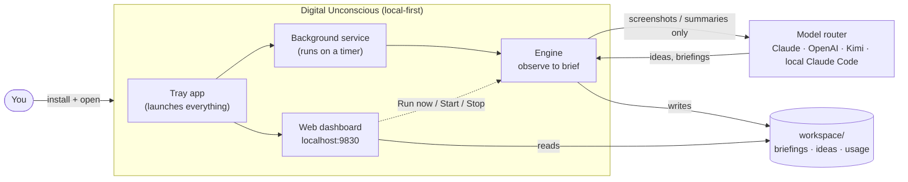
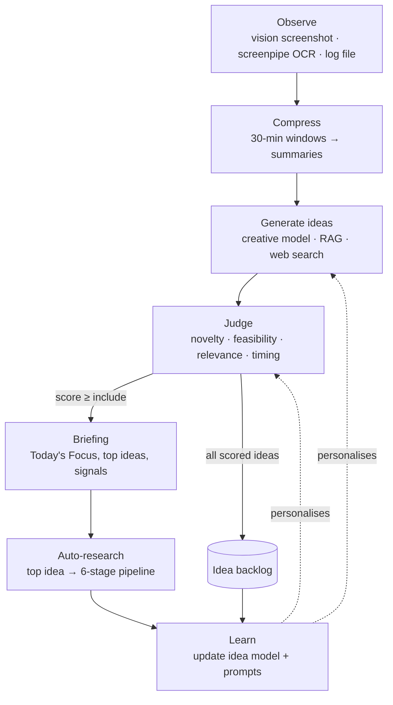
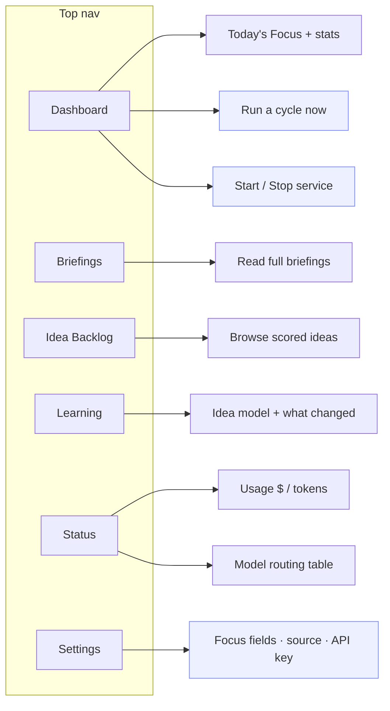
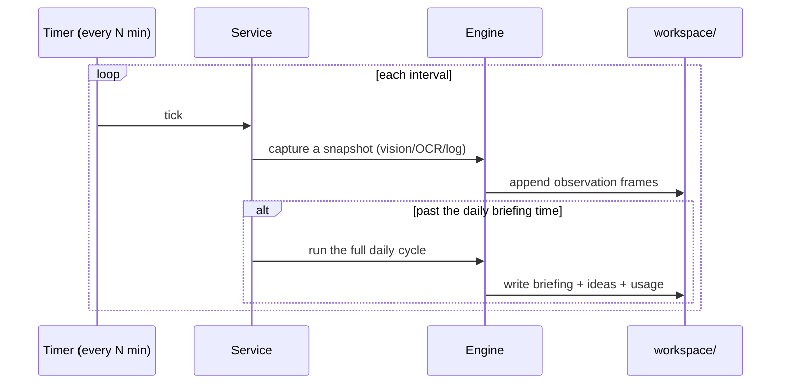

# Product Interaction Diagram

How a person actually uses Digital Unconscious, end to end. The guiding principle:

> **Install → open → it works.** The browser dashboard is the only surface a user needs. Everything else — observation, idea generation, judging, research — runs in the background. No commands or config files are required.

Every diagram below renders on GitHub.

---

## 1. The product at a glance



The user touches exactly two things: the **tray icon** (once, to launch) and the **dashboard** (to read briefings and press a button). The model router and engine are invisible.

---

## 2. First run — from install to first idea

```mermaid
sequenceDiagram
  actor U as You
  participant CLI as du (launcher)
  participant DASH as Dashboard
  participant SVC as Background service
  participant ENG as Engine

  U->>CLI: pip install ... ; du
  CLI->>DASH: start dashboard + open browser at /setup
  CLI->>SVC: start background service
  DASH-->>U: Setup wizard (focus fields · source · API key)
  U->>DASH: pick "Automatic", paste a key, Start
  DASH->>DASH: save nested settings + setup_complete marker
  DASH-->>U: Dashboard ("Run your first cycle" CTA)
  U->>DASH: click "Run a cycle now"
  DASH->>ENG: du daily (background)
  ENG->>ENG: observe → compress → generate → judge → brief
  ENG-->>DASH: writes briefing + usage.json
  DASH-->>U: page auto-refreshes → Today's Focus + ideas
```

Two clicks to value: finish the wizard, press **Run a cycle now**. After that the service delivers a briefing every day on its own.

---

## 3. The daily loop (the heart of the product)



The loop is a **fixed pipeline** (predictable, schedulable), but each stage is LLM-native: structured outputs, optional extended thinking, and web search when the model hits something unfamiliar or trending.

---

## 4. Dashboard — information architecture & actions



Highlighted nodes are **actions the user takes in the browser** — there is a webpage path for everything that used to need a command: running a cycle, controlling the service, seeing spend/routing, and changing settings.

---

## 5. Background service (unattended operation)



The service accumulates observations through the day and produces one briefing at the configured time — so the user just opens the dashboard and reads.

---

## 6. What we changed, and why (interaction friction → fix)

| Friction (before) | Fix |
| --- | --- |
| Setup wizard never opened on launch (kept silent) | Open on true first run via a dedicated completion marker |
| All controls were CLI commands | Run-now, Start/Stop, Settings, Usage & Routing — all in the dashboard |
| Vision needed an explicit, jargon-heavy setup | "Automatic" source by default; one optional key field; plain-language copy |
| "Focus fields" was unexplained | "Leave blank to get ideas from everything" |
| Dashboard buried the value | "Today's Focus" surfaced on the home screen, above the fold |
| Flat, brandless UI | Visual identity (logo + wordmark), design system, clear button hierarchy |
| No feedback after pressing Run | Button shows progress and the page auto-refreshes when the cycle lands |
| Vision could silently do nothing without a key | Clear warning + setup copy explaining a key is required |

## 7. Design principles

1. **One surface.** If a user needs it regularly, it lives in the dashboard — never only in the CLI.
2. **Value first.** The home screen shows today's insight, not configuration.
3. **Sensible defaults.** "Automatic" everything; the only thing worth asking up front is what fields you care about and (optionally) a key.
4. **Invisible machinery.** Multi-provider routing, failover, thinking budgets, and retention all run without the user knowing they exist.
5. **Predictable, not chatty.** A fixed daily pipeline the user can trust, with LLM tools used inside stages rather than an open-ended agent loop.
